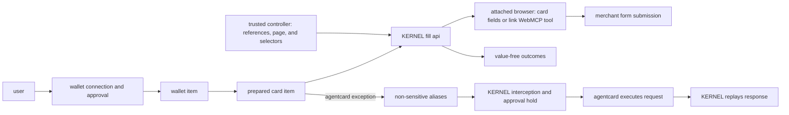

your browser agent can complete purchases with KERNEL while your application keeps control of the purchase and user approval. native [wallet integrations](/integrations/wallets/overview) connect the user's payment method to a [vault](/vaults/overview), so your agent works with payment items rather than raw card details.

KERNEL's [`fill` api](/vaults/fill) safely injects stored values into browser fields without passing them through your application's injection code or the model's context. you provide an item reference, browser, and page, plus field selectors when the item needs them; KERNEL supplies the values and returns outcomes, not the values. wallet integrations supply payment material and approval; `fill` is a KERNEL operation shared with non-payment vault items.

agentcard uses an integration-specific alternative: the agent enters non-sensitive aliases, and KERNEL holds a recognized checkout request for approval before agentcard executes it and KERNEL replays the response. the underlying card stays outside the browser.

## Why use KERNEL payments

- **keep raw values out of the application and model handoff.** use KERNEL's `fill` api to inject stored payment values instead of retrieving them and passing them through application code or agent prompts.
- **connect wallets through native integrations.** use vault items, advertised operations, and hosted actions for connection and purchase approval. KERNEL handles the provider interaction, including link card issuance or agentcard's approved request execution and response replay.
- **control the purchase.** verify purchase details in your application and present provider-hosted approval to the user outside the agent. vault attachments and item lifecycle checks control which browser can use the payment item.
- **observe the attempt.** inspect value-free operation outcomes and item events, then reconcile with the merchant's order record. a completed fill or approval is not proof of payment.

## How payments work

1. create a vault for the user or task.
2. create a wallet item and send the user through the provider-hosted collection flow.
3. attach the vault when you create the browser session. the attachment also covers items created later in that vault.
4. create a card item for the verified, user-confirmed purchase and complete the provider's approval. for link, create it at the final checkout page with the browser session and exact page url; KERNEL picks a link pay token or a one-time virtual card. agentcard can reuse a card item with separate approval for each checkout.
5. invoke KERNEL's advertised `fill` operation to supply the payment credential without handling its values, then inspect the outcomes before submitting. `fill` never clicks pay. for agentcard's alias-based flow, enter aliases and keep a trusted approval observer running while the checkout request is held.
6. have the agent click pay once, complete any remaining provider-hosted approval, and reconcile with the merchant's order state. fill or approval alone is not payment success.

`wallet` and `card` are vault item types. the wallet supplies the provider connection; the card represents payment material and its authorization state. retrieve the item and check `available_operations` before invoking an operation. don't assume every item supports `fill`.

## Verify the purchase

your application must independently verify the merchant, items, amount, and currency before creating a card item for a purchase. keep wallet collection and approval urls in trusted user-facing surfaces, not model context. after submission, use the merchant's order record to establish whether the expected purchase succeeded.

<Warning>
  don't retry a failed, timed-out, rejected, or indeterminate payment. a browser error, missing response, completed `fill`, or reusable card item does not prove whether the merchant created an order or money moved. inspect existing outcomes, item events, and merchant state before taking another action.
</Warning>

## Get started

- [choose a wallet integration](/integrations/wallets/overview) for payment-method connection, approval, and reuse options.
- [enable payments in a browser agent](/browsers/enable-payments-in-browser-agent) for the controller, agent, and checkout walkthrough.
- [fill browser fields](/vaults/fill) for KERNEL's injection api, field selection, and outcome contract.
