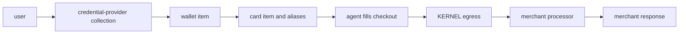

your browser agent can complete a web checkout without exposing the card number
or cvc to your application, agent, or browser. this design reduces card-data
exposure and avoids expanding pci dss scope.

<span className="kernel-brand-name">KERNEL</span> connects that payment method
to a [vault](/vaults), returns non-secret aliases, and resolves those aliases at
browser egress. the agent fills the checkout form with the aliases. the merchant
page creates its normal payment request.
<span className="kernel-brand-name">KERNEL</span> handles authorization and
payment handoff outside the browser.

link and agentcard are credential providers, not merchant payment
processors. at the browser form layer, both work with any web checkout that
accepts standard card details, and the merchant's processor does not need to be
stripe. end-to-end handoff also requires the outgoing payment request to match a
native <span className="kernel-brand-name">KERNEL</span> processor adapter.

## How payments work

start with KERNEL-managed credentials. bringing your own client is optional:
see [link setup](/integrations/payments/stripe-link#before-you-start) or
[agentcard setup](/integrations/payments/agentcard#before-you-start). with your
own link client, your backend must handle user oauth and securely import the
grant instead of using KERNEL's hosted connection flow.

both credential providers use the same integration shape:

1. create a vault for the user or task.
2. create a wallet item and send the user through the provider-hosted collection flow.
3. create a card item for the intended purchase and wait for aliases.
4. attach the vault when you create the browser session.
5. give the aliases to the agent and let it complete the merchant's checkout.
6. complete any provider-hosted approval and inspect item events alongside the merchant's order state.

for normal setup, keep at most one wallet item for each provider in a vault.
imported link grant recovery uses an explicit cutover to a new wallet while
unresolved old items are retained; see the optional link setup above. before
showing a provider connection option, list the vault's items. if that provider
already has a wallet in any state, hide the add option and reuse or recover the
existing item. when both link and agentcard wallets exist, show both as
configured and do not offer either provider again.



the card number and cvc stay outside the agent-controlled environment. the browser sees format-valid aliases and the processor-shaped response, not the underlying payment credential.

## Choose a provider

<CardGroup cols={2}>
  <Card
    title="link by stripe"
    href="/integrations/payments/stripe-link"
    icon="link"
  >
    collect a link wallet and approve a one-use credential for a specific
    purchase.
  </Card>
  <Card
    title="Agentcard"
    href="/integrations/payments/agentcard"
    icon="credit-card"
  >
    add users' cards to agentcard's vault. the user approves each transaction
    with Face ID and earns points on the purchase.
  </Card>
</CardGroup>

<Note>
  link and agentcard identify where the credential comes from and how the
  user approves it. choose between them based on that lifecycle, not the
  merchant processor. processor-adapter coverage is the same for both.
</Note>

| behavior                  | link by stripe                                            | agentcard                                                           |
| ------------------------- | -------------------------------------------------------- | ------------------------------------------------------------------- |
| payment-method collection | hosted `link_oauth` action                               | fully white-labeled `card_enrollment` page                          |
| purchase authorization    | explicit `authorize` operation before checkout           | the user approves with Face ID                                      |
| payment handoff           | one-use credential substituted at egress                 | agentcard executes the request and returns the response             |
| reuse                     | card item and aliases are consumed on first substitution | cards can be reused for recurring and one-time purchases            |
| environment               | live only                                                | credential-defined; customer-owned configs expose `test_mode` |

choose [link by stripe](https://hypeship.dev/integrations/payments/stripe-link) when each purchase requires a newly approved, single-use credential. choose [agentcard](https://hypeship.dev/integrations/payments/agentcard) when one enrolled card must support multiple purchases, with separate approval for each.

both integrations may provide additional benefits, including card rewards and chargeback protection. review each provider’s own documentation for the most up-to-date details.

## Checkout and processor coverage

<span className="kernel-brand-name">KERNEL</span> currently includes native
adapters for these checkout request formats. all five adapters are enabled for
both link and agentcard.

| merchant processor or platform | recognized HTTPS `POST` request formats                                                                                                                                                     |
| ------------------------------ | ------------------------------------------------------------------------------------------------------------------------------------------------------------------------------------------- |
| stripe                         | form requests to `api.stripe.com/v1/payment_methods`, `/v1/tokens`, `/v1/payment_intents/{id}/confirm`, and `/v1/payment_pages/{id}/confirm`                                                |
| shopify                        | JSON card-session requests to `checkout.pci.shopifyinc.com/sessions` and `deposit.<region>.shopifycs.com/sessions`                                                                          |
| square                         | JSON card-nonce requests to `pci-connect.squareup.com/v2/card-nonce` and `pci-connect.squareupsandbox.com/v2/card-nonce`                                                                    |
| recurly                        | form token requests to `api.recurly.com/js/v1/token` and `api.eu.recurly.com/js/v1/token`                                                                                                   |
| razorpay                       | form card-payment requests to `api.razorpay.com/v1/payments/create/ajax` and `api.razorpay.com/v1/standard_checkout/payments/create/ajax`                                                   |

for example, a browser can enter link or agentcard aliases into a Shopify
checkout. Shopify remains the merchant platform; link or agentcard
supplies the credential and approval flow.

the outgoing request must contain the complete alias set and match the adapter's
expected HTTPS method, host, path, content type, and card-field layout. these
adapters are enabled today, but non-Stripe coverage still needs broader
validation against real processor SDKs and hosted checkouts. encrypted payloads,
different request layouts, and unrecognized processor endpoints pass through
without native handoff.

<span className="kernel-brand-name">KERNEL</span>'s native handoff aims to
support the same processors supported by agentcard's direct SDK. email
[support@kernel.sh](mailto:support@kernel.sh) if you need another processor so
we can prioritize its adapter and validate a real checkout.

## Why use KERNEL handoff

- integrate with one <span className="kernel-brand-name">KERNEL</span> vault api for both link by stripe and agentcard.
- let <span className="kernel-brand-name">KERNEL</span> intercept recognized payment requests at egress, including requests from embedded payment frames, instead of maintaining cdp interception or page-routing logic in your agent.
- verify the project, browser session, vault attachment, item, aliases, and lifecycle state before handoff, then record the payment lifecycle in vault audit events.
- keep the underlying credential outside your application, agent, and browser through aliases and provider-hosted enrollment and approval.

the handoff is designed to prevent credential injection and browser-to-provider
handoff failures. we don't yet have comparative data showing higher checkout
completion or payment acceptance rates. expanding acceptance coverage against
real processors and measuring reliability are active priorities.

<Warning>
  don't retry a failed, timed-out, rejected, or indeterminate payment. a browser
  error, missing response, consumed link item, or reusable agentcard item does
  not prove whether the merchant created an order or money moved. inspect the
  existing item events and the merchant's order state before taking another
  action.
</Warning>

## Next step

configure [link by stripe](/integrations/payments/stripe-link) or [agentcard](/integrations/payments/agentcard), then follow [Enable Payments in a Browser Agent](/browsers/enable-payments-in-browser-agent) to attach the vault and give payment aliases to your agent.

the provider pages show the CLI commands for creating wallets and cards. once
the card item is ready, the shared CLI flow is:

```bash CLI
kernel vaults create --name user-12345
kernel vaults items get user-12345 notebook-order --wait 60 -o json
kernel browsers create --vault user-12345 -o json
```

`--wait` performs one bounded observation. it does not confirm that a payment
succeeded, and the CLI does not submit or retry merchant payments.
