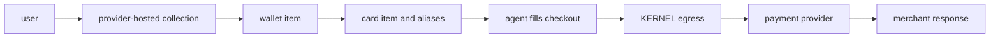

your browser agent can complete a web checkout without bringing your application, agent, or browser into pci dss scope. a provider-hosted flow collects and stores the user's payment method, so neither you nor your agent handles the card number or cvc.

<span className="kernel-brand-name">KERNEL</span> connects that payment method
to a [vault](/vaults), returns non-secret aliases, and resolves those aliases at
browser egress. the agent fills the checkout form with the aliases. the merchant
page creates its normal payment request.
<span className="kernel-brand-name">KERNEL</span> handles authorization and
payment handoff outside the browser.

## How payments work

both supported providers use the same integration shape:

1. create a vault for the user or task.
2. create a wallet item and send the user through the provider-hosted collection flow.
3. create a card item for the intended purchase and wait for aliases.
4. attach the vault when you create the browser session.
5. give the aliases to the agent and let it complete the merchant's checkout.
6. complete any provider-hosted approval and inspect item events alongside the merchant's order state.

each vault must contain at most one wallet item for each provider. before
showing a provider connection option, list the vault's items. if that provider
already has a wallet in any state, hide the add option and reuse or recover the
existing item. when both stripe link and agentcard wallets exist, show both as
configured and do not offer either provider again.



the card number and cvc stay outside the agent-controlled environment. the browser sees format-valid aliases and the processor-shaped response, not the underlying payment credential.

## Choose a provider

<CardGroup cols={2}>
  <Card
    title="stripe link"
    href="/integrations/payments/stripe-link"
    icon="link"
  >
    collect a stripe link wallet and approve a one-use credential for a specific
    purchase.
  </Card>
  <Card
    title="Agentcard"
    href="/integrations/payments/agentcard"
    icon="credit-card"
  >
    enroll a card with Agentcard and approve each checkout while the request is
    held.
  </Card>
</CardGroup>

<Note>
  <span className="kernel-brand-name">KERNEL</span> is actively adding native
  integrations with more payment providers. email
  [support@kernel.sh](mailto:support@kernel.sh) to request one.
</Note>

| behavior                  | stripe link                                              | agentcard                                                           |
| ------------------------- | -------------------------------------------------------- | ------------------------------------------------------------------- |
| payment-method collection | hosted `link_oauth` action                               | hosted `card_enrollment` action                                     |
| purchase authorization    | explicit `authorize` operation before checkout           | approval begins when the browser submits checkout                   |
| payment handoff           | one-use credential substituted at egress                 | provider executes the held request and returns the response         |
| reuse                     | card item and aliases are consumed on first substitution | card item and aliases remain reusable; each checkout needs approval |
| environment               | live only                                                | configured agentcard credential; not exposed through the vault api  |

choose [stripe link](/integrations/payments/stripe-link) when each purchase needs a newly approved, one-use credential. choose [agentcard](/integrations/payments/agentcard) when the same enrolled card must support multiple separately approved purchases.

## Supported checkouts

the initial release recognizes form-encoded card requests sent to `api.stripe.com` on these paths:

- `/v1/payment_methods`
- `/v1/tokens`
- `/v1/payment_intents/{id}/confirm`
- `/v1/payment_pages/{id}/confirm`

the request must contain the complete alias set. arbitrary processors, custom request formats, and every possible stripe integration are not supported in the initial release.

<Warning>
  don't retry a failed, timed-out, rejected, or indeterminate payment. a browser
  error, missing response, consumed link item, or reusable agentcard item does
  not prove whether the merchant created an order or money moved. inspect the
  existing item events and the merchant's order state before taking another
  action.
</Warning>

## Next step

configure [stripe link](/integrations/payments/stripe-link) or [agentcard](/integrations/payments/agentcard), then follow [Enable Payments in a Browser Agent](/browsers/enable-payments-in-browser-agent) to attach the vault and give payment aliases to your agent.

the provider pages show the CLI commands for creating wallets and cards. once
the card item is ready, the shared CLI flow is:

```bash CLI
kernel vaults create --name user-12345
kernel vaults items get user-12345 notebook-order --wait 60 -o json
kernel browsers create --vault user-12345 -o json
```

`--wait` performs one bounded observation. it does not confirm that a payment
succeeded, and the CLI does not submit or retry merchant payments.
