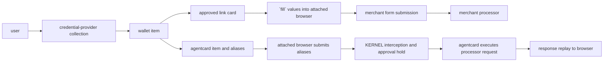

<span className="kernel-brand-name">KERNEL</span> connects a user's payment method to a [vault](/vaults/overview). wallet connection and purchase approval use provider-hosted flows. checkout has two distinct paths:

- **link by stripe:** the browser agent receives a approved, provider-issued single-use card and then uses [fill](/vaults/fill) to write card values into an attached browser without exposing the card details to the application or model.
- **agentcard:** the agent enters non-secret aliases. KERNEL intercepts a recognized processor request from the attached browser, holds it for approval, and replays the provider's response. the underlying card stays with agentcard.

link and agentcard are credential providers, not merchant payment processors. the merchant's processor doesn't need to be stripe. link depends on supported checkout inputs and the allowed merchant origin; agentcard handoff requires a native processor adapter.

<Warning>
  the link + `fill` path enters single-use card values into the browser, including page scripts, extensions, and agents with browser or cdp access. don't assume those values are excluded from recordings.
</Warning>

## How payments work

use KERNEL-managed credentials by default. if you need to use your own oauth
client, choose the customer-managed setup near the start of the
[link](/integrations/payments/stripe-link#choose-an-oauth-client) or
[agentcard](/integrations/payments/agentcard#choose-an-oauth-client) guide before
you create a wallet.

both credential providers start with a wallet and an attached browser, then diverge at checkout:

1. create a vault for the user or task.
2. create a wallet item and send the user through the provider-hosted collection flow.
3. create a card item for the verified, user-confirmed purchase. for link, authorize it and complete provider approval before filling.
4. attach the vault when you create the browser session.
5. for link, invoke the advertised `fill` operation and inspect its outcomes before submitting. for agentcard, enter aliases and keep a trusted approval observer running while the checkout request is held.
6. submit checkout once, complete any remaining provider-hosted approval, and reconcile with the merchant's order state. fill or approval alone is not payment success.

each vault must contain at most one wallet item for each provider. before
showing a provider connection option, list the vault's items. if that provider
already has a wallet in any state, hide the add option and reuse or recover the
existing item. when both link and agentcard wallets exist, show both as
configured and do not offer either provider again.



## Choose a provider

<CardGroup cols={2}>
  <Card
    title="link by stripe"
    href="/integrations/payments/stripe-link"
    icon="link"
  >
    collect a link wallet and approve a one-use credential for a specific
    purchase.
  </Card>
  <Card
    title="Agentcard"
    href="/integrations/payments/agentcard"
    icon="credit-card"
  >
    add users' cards to agentcard's vault. the user approves each transaction
    with Face ID and earns points on the purchase.
  </Card>
</CardGroup>

<Note>
  link and agentcard identify where the credential comes from and how the
  user approves it. choose between them based on that lifecycle, not the
  merchant processor. only agentcard's alias handoff depends on processor-adapter coverage.
</Note>

| behavior                  | link by stripe                                            | agentcard                                                           |
| ------------------------- | -------------------------------------------------------- | ------------------------------------------------------------------- |
| user eligibility          | requires a US phone number                               | —                                                                   |
| payment-method collection | hosted `link_oauth` action                               | fully white-labeled `card_enrollment` page                          |
| purchase authorization    | explicit `authorize` operation before checkout           | the user approves with Face ID                                      |
| payment handoff           | use `fill` to insert values into browser without exposing to the agent or model      | agentcard executes the intercepted request; KERNEL replays the response |
| reuse                     | provider-issued single-use card | reusable card item; each checkout requires approval             |
| environment               | live only                                                | credential-defined; customer-owned configs expose `test_mode`       |

choose [link by stripe](/integrations/payments/stripe-link) to enable users to pay with cards stored in their link wallet, each purchase is paid by a newly approved, single-use card. choose [agentcard](/integrations/payments/agentcard) to enable users to pay with their actual cards, the same card can be used for multiple purchases and user-approval is required for each.

both integrations may provide additional benefits, including card rewards and chargeback protection. review each provider’s own documentation for the most up-to-date details.

## Checkout and processor coverage

link fill does not use processor adapters. it requires one exact current top-level https page at the card's `merchant_url` origin and uniquely selectable editable inputs or selects, including those in descendant payment frames. see [link card fields](/integrations/payments/stripe-link#map-card-fields-to-inputs) for supported card and billing fields. field filling does not guarantee processor acceptance.

agentcard's alias handoff uses native adapters for these checkout request formats:

| merchant processor or platform | recognized HTTPS `POST` request formats                                                                                                                                                     |
| ------------------------------ | ------------------------------------------------------------------------------------------------------------------------------------------------------------------------------------------- |
| stripe                         | form requests to `api.stripe.com/v1/payment_methods`, `/v1/tokens`, `/v1/payment_intents/{id}/confirm`, and `/v1/payment_pages/{id}/confirm`                                                |
| shopify                        | JSON card-session requests to `checkout.pci.shopifyinc.com/sessions` and `deposit.<region>.shopifycs.com/sessions`                                                                          |
| square                         | JSON card-nonce requests to `pci-connect.squareup.com/v2/card-nonce` and `pci-connect.squareupsandbox.com/v2/card-nonce`                                                                    |
| recurly                        | form token requests to `api.recurly.com/js/v1/token` and `api.eu.recurly.com/js/v1/token`                                                                                                   |
| razorpay                       | form card-payment requests to `api.razorpay.com/v1/payments/create/ajax` and `api.razorpay.com/v1/standard_checkout/payments/create/ajax`                                                   |

for example, an attached browser can enter agentcard aliases into a shopify checkout. shopify remains the merchant platform; agentcard supplies the credential and approval flow.

the outgoing request must contain the complete alias set and match the adapter's
expected HTTPS method, host, path, content type, and card-field layout. these
adapters are enabled today, but non-Stripe coverage still needs broader
validation against real processor SDKs and hosted checkouts. encrypted payloads,
different request layouts, and unrecognized processor endpoints pass through
without native handoff.

<span className="kernel-brand-name">KERNEL</span>'s native handoff aims to
support the same processors supported by agentcard's direct SDK. email
[support@kernel.sh](mailto:support@kernel.sh) if you need another processor so
we can prioritize its adapter and validate a real checkout.

## Why use KERNEL handoff

- integrate with one <span className="kernel-brand-name">KERNEL</span> vault api for both link by stripe and agentcard.
- `fill` link card fields with value-free requests and responses, while recognizing that actual values enter the browser.
- let <span className="kernel-brand-name">KERNEL</span> intercept recognized agentcard payment requests at egress, including requests from embedded payment frames, instead of maintaining interception logic in your agent.
- enforce project, browser, vault attachment, and item lifecycle checks for both paths, plus merchant-origin restrictions for link fill.
- keep agentcard's underlying card outside the browser through aliases and provider-hosted execution.

neither path guarantees checkout completion or payment acceptance. verify the merchant's order state after submission.

<Warning>
  don't retry a failed, timed-out, rejected, or indeterminate payment. a browser
  error, missing response, completed `fill`, or reusable agentcard item does
  not prove whether the merchant created an order or money moved. inspect the
  existing item events and the merchant's order state before taking another
  action.
</Warning>

## Next step

configure [link by stripe](/integrations/payments/stripe-link) or [agentcard](/integrations/payments/agentcard), then follow [enable payments in a browser agent](/browsers/enable-payments-in-browser-agent) to attach the vault and use the wallet's checkout path.

the provider pages show the CLI commands for creating wallets and cards. once
the card item is ready, the shared CLI flow is:

```bash CLI
kernel vaults create --name user-12345
kernel vaults items get user-12345 notebook-order --wait 60 -o json
kernel browsers create --vault user-12345 -o json
```

`--wait` performs one bounded observation. it does not confirm that a payment
succeeded, and the CLI does not submit or retry merchant payments.
