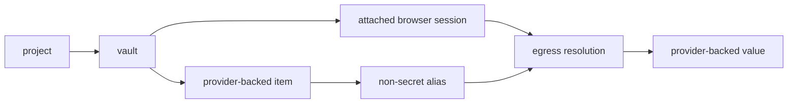

**status:** <Badge color="yellow">preview</Badge>

<span className="kernel-brand-name">KERNEL</span> vaults are project-scoped
containers for provider-backed items. they let a browser session use a value
without placing the underlying value in the page, agent context, screenshots, or
browser replay.

the primitive separates four concerns: a vault scopes access, an item describes a provider-backed value, an alias gives the browser a non-secret placeholder, and an action or operation advances provider state outside the browser. egress resolves an alias only when the browser, session, project, vault, item, and provider state all match.

<Note>
  vaults are in preview. the initial release supports `wallet` and `card` items
  for [link](/integrations/payments/link) and
  [agentcard](/integrations/payments/agentcard). the vault model is not limited
  to payments, but no other item types or providers are supported in this
  release.
</Note>

## Resource model

| resource           | technical behavior                                                                                    |
| ------------------ | ----------------------------------------------------------------------------------------------------- |
| vault              | project-owned container with an immutable `name`                                                      |
| item               | provider-backed value addressed by an immutable `key`; the initial item types are `wallet` and `card` |
| alias              | non-secret, format-valid placeholder returned in item state; aliases belong to an item                |
| action             | user interaction returned as `action`, such as a hosted collection or approval url                    |
| operation          | explicit api action advertised in `available_operations`; the initial operation type is `authorize`   |
| expansion          | live provider data advertised in `available_expansions`; the initial expansion is `payment_methods`   |
| event              | immutable item observation with `id`, `name`, optional `browser_id`, `data`, and `created_at`         |
| browser attachment | vault reference fixed when the browser is created                                                     |



## Scope and attachment

select project scope on the sdk client or use a project-scoped api key. for direct api requests, `X-Kernel-Project` accepts a project id or name. `project_id` is not accepted in a vault request body. without explicit project scope, <span className="kernel-brand-name">KERNEL</span> uses the organization's default project.

attach vaults when you create a browser:

<CodeGroup>

```typescript TypeScript
const browser = await kernel.browsers.create({
  vaults: [{ id: vault.id }],
});
```

```python Python
browser = kernel.browsers.create(
    vaults=[{"id": vault.id}],
)
```

</CodeGroup>

the `vaults` array supports up to 20 references. each reference accepts exactly one of `id` or `name`, and attachments cannot change after browser creation. a browser and vault must belong to the same project.

attachment grants the browser access to the vault, not to a selected set of items. items created later in the same vault are available to every attached browser in that project. use separate vaults when browser tasks must not share access. deleting a vault or item invalidates its provider-backed values and aliases.

## Api behavior

create or retrieve a vault by its immutable `name`. names accept 1–255 letters, numbers, `.`, `_`, and `-`, but can't use a cuid-like value that could be mistaken for a vault id. vault responses contain `id`, `name`, `created_at`, and `updated_at`.

item keys are immutable and accept 1–255 letters, numbers, `.`, `_`, and `-`. creating an item at an existing key succeeds only when its type, provider, and specification match the existing item and its lifecycle permits retrieval. otherwise, the api returns a conflict. a card's `spec.wallet` must reference a wallet in the same vault and from the same provider.

retrieve an item before acting on it. responses expose these fields and advertise what the current state permits:

| field                                    | behavior                                             |
| ---------------------------------------- | ---------------------------------------------------- |
| `id`, `key`, `type`                      | stable item identity; `key` and `type` cannot change |
| `spec`                                   | provider-specific input saved with the item          |
| `state`                                  | provider-specific status and non-secret output       |
| `action`                                 | current user action, when one is required            |
| `available_operations`                   | operations valid in the current state                |
| `available_expansions`                   | live provider data the item can request              |
| `expanded`                               | requested live data; not persisted on the item       |
| `expires_at`, `created_at`, `updated_at` | item timestamps when present                         |

when `action` is present, complete it in a trusted user-facing surface. invoke only operations listed in `available_operations`, and request only expansions listed in `available_expansions`. don't hard-code provider transitions from a previous response.

item reads accept `wait` values from 0–60 seconds. a read returns early when the item no longer has an unresolved authorization or approval transition. event reads support the same maximum wait and return an ordered array. use the last event `id` as the `after` cursor for newer events.

deleting a card consumes its aliases and clears any stored provider value. deleting a wallet also invalidates its dependent card items. deleting a vault invalidates every item it contains.

see the [vaults api reference](https://kernel.sh/docs/api-reference/vaults/create-or-retrieve-a-vault-by-immutable-name) for endpoints and complete request and response schemas.

## Initial item specifications

the initial release accepts these `spec` fields. fields not listed here are rejected.

### Wallet items

| provider  | required fields                                                                                    | optional fields                                                            |
| --------- | -------------------------------------------------------------------------------------------------- | -------------------------------------------------------------------------- |
| link      | `provider: 'link'`, `authorization.method: 'oauth'`, `authorization.client.type: 'kernel_managed'` | none                                                                       |
| agentcard | `provider: 'agentcard'`                                                                            | `user_id` for a user already enrolled through a wallet in the organization |

### Card items

| provider  | required fields                                                                                                     | optional fields                                  |
| --------- | ------------------------------------------------------------------------------------------------------------------- | ------------------------------------------------ |
| link      | `provider`, `wallet`, `payment_method_id`, `amount`, `currency`, `merchant_name`, `merchant_url`, `context`, `test` | `line_items`, `totals`, `metadata`, `expires_at` |
| agentcard | `provider`, `wallet`, `merchant`, `amount`, `currency`                                                              | `card_id`                                        |

`amount` uses minor currency units. link accepts 1–500000, requires a three-letter `currency`, limits `merchant_name` to 255 characters, requires an absolute http or https `merchant_url`, and requires at least 100 characters in `context`. its optional `expires_at` is a unix timestamp in seconds.

agentcard accepts amounts from 1–9007199254740991 and a three-letter `currency`. `merchant` accepts 1–120 printable characters without control characters. `card_id` uses the provider's `vc_` identifier, and wallet `user_id` uses its `usr_` identifier.

link `line_items` support `name`, `quantity`, `unit_amount`, `description`, `sku`, `url`, `image_url`, `product_url`, and `totals`. each `totals` entry supports `type`, `display_text`, and `amount`. link `metadata` accepts string values.

card updates replace the complete `spec`; they are not partial merges. link card items can update only while `requested`. agentcard card items can update while `requested` or `ready`, but not while approval is pending.

## Initial actions, states, and aliases

`action.name` can be `link_oauth`, `spend_approval`, `push_approval`, `collect`, `mfa`, `embedded_ceremony`, or `card_enrollment`. actions that require a hosted interaction include a `url`. don't send action urls or provider authorization material to the agent.

wallet status values are:

- link: `pending_authorization`, `connected`, `declined`, `reconnect_required`, `degraded`
- agentcard: `pending_authorization`, `connected`, `degraded`

card status values are:

- link: `requested`, `pending_authorization`, `ready`, `consumed`, `expired`, `declined`
- agentcard: `requested`, `ready`, `pending_approval`, `degraded`

card state can include `masks.brand`, `masks.last4`, and read-only aliases: `number`, `cvc`, `exp_month`, and `exp_year`. aliases are non-secret placeholders, not standalone credentials or permission to use the provider-backed value.

for the payment-specific lifecycle, read the [payments overview](/integrations/payments/overview). to complete a checkout, follow [Pay Through a Browser Checkout](/browsers/pay-through-browser-checkout).
