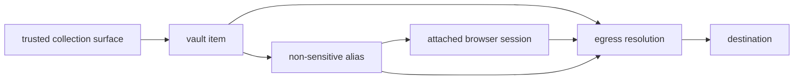

**status:** <Badge color="yellow">preview</Badge>

browser agents become more useful when they can finish tasks that require
sensitive values: checking out with a card, signing in with a password, or
completing a form with identity data. handing those values to an agent exposes
them to model context, logs, page scripts, extensions, devtools, screenshots,
and browser replay. withholding them keeps the agent from finishing the task.

<span className="kernel-brand-name">KERNEL</span> vaults let an attached browser
session use a sensitive value without revealing that value to the agent or the
browser vm. the agent receives a non-sensitive stand-in called an alias. the
browser submits the alias, and <span className="kernel-brand-name">KERNEL</span>
resolves it at egress after the request leaves the browser vm.

vaults are a general primitive for separating what an agent can use from what it
can see. typed items describe provider-backed values, aliases give agents usable
stand-ins, and immutable browser bindings control where those aliases can be
resolved.

<Note>
  vaults are in preview. the initial release supports `wallet` and `card` items
  for [stripe link](/integrations/payments/stripe-link) and
  [agentcard](/integrations/payments/agentcard). the vault model is not limited
  to payments, but no other item types or providers are supported in this
  release.
</Note>

## How vaults work

### Values do not come back through the api

sensitive values do not have a read path through the vault api. item responses
return non-sensitive specifications, state, masks, aliases, actions, and events,
but not the underlying value. for the initial payment integrations, a
provider-hosted flow collects the user's payment method and the provider-backed
card reaches the vault without passing through your application or agent.

### Agents use aliases

each item can publish non-sensitive, format-valid aliases. in the initial
release, a card item can return a luhn-valid 16-digit number, a three-digit cvc,
and an expiry month and year. these values pass client-side checkout validation
but cannot resolve unless the browser session and vault are bound together.

### Vaults attach to browser sessions

attach one or more vaults when you create a browser. the binding cannot change
for the life of the session and is enforced outside the browser vm. the agent
uses aliases like any other form input.

### Substitution happens at egress

the <span className="kernel-brand-name">KERNEL</span> egress layer runs outside
the browser vm. when it recognizes a request containing an alias, it verifies
the browser, session, project, vault, item, and provider state before resolving
the provider-backed value. the browser receives the destination's response
without receiving that value. resolution fails closed when any binding or state
check does not match.

## Resource model

| resource           | technical behavior                                                                                  |
| ------------------ | --------------------------------------------------------------------------------------------------- |
| vault              | resource with an immutable `name` that groups provider-backed items                                 |
| item               | typed, provider-backed value addressed by an immutable `key`; initial types are `wallet` and `card` |
| alias              | non-sensitive, format-valid stand-in returned in item state; aliases belong to an item              |
| action             | user interaction returned as `action`, such as a hosted collection or approval url                  |
| operation          | explicit api action advertised in `available_operations`; the initial operation type is `authorize` |
| expansion          | live provider data advertised in `available_expansions`; the initial expansion is `payment_methods` |
| event              | immutable item observation with `id`, `name`, optional `browser_id`, `data`, and `created_at`       |
| browser attachment | vault reference fixed when the browser is created                                                   |



## Scope and attachment

select project scope on the sdk client or use a project-scoped api key. for direct api requests, `X-Kernel-Project` accepts a project id or name. `project_id` is not accepted in a vault request body. without explicit project scope, <span className="kernel-brand-name">KERNEL</span> uses the organization's default project.

attach vaults when you create a browser:

<CodeGroup>

```typescript TypeScript
const browser = await kernel.browsers.create({
  vaults: [{ id: vault.id }],
});
```

```python Python
browser = kernel.browsers.create(
    vaults=[{"id": vault.id}],
)
```

```bash CLI
kernel browsers create --vault user-12345 -o json
```

</CodeGroup>

the `vaults` array supports up to 20 references. each reference accepts exactly one of `id` or `name`, and attachments cannot change after browser creation. a browser and vault must belong to the same project.

attachment grants the browser access to the vault, not to a selected set of items. items created later in the same vault are available to every attached browser in that project. use separate vaults when browser tasks must not share access. deleting a vault or item invalidates its provider-backed values and aliases.

## Api behavior

create or retrieve a vault by its immutable `name`. names accept 1–255 letters, numbers, `.`, `_`, and `-`, but can't use a cuid-like value that could be mistaken for a vault id. vault responses contain `id`, `name`, `created_at`, and `updated_at`.

```bash CLI
kernel vaults create --name user-12345
kernel vaults get user-12345 -o json
kernel vaults items list user-12345 -o json
```

item keys are immutable and accept 1–255 letters, numbers, `.`, `_`, and `-`. creating an item at an existing key succeeds only when its type, provider, and specification match the existing item and its lifecycle permits retrieval. otherwise, the api returns a conflict.

retrieve an item before acting on it. responses expose these fields and advertise what the current state permits:

| field                                    | behavior                                             |
| ---------------------------------------- | ---------------------------------------------------- |
| `id`, `key`, `type`                      | stable item identity; `key` and `type` cannot change |
| `spec`                                   | provider-specific input saved with the item          |
| `state`                                  | provider-specific status and non-secret output       |
| `action`                                 | current user action, when one is required            |
| `available_operations`                   | operations valid in the current state                |
| `available_expansions`                   | live provider data the item can request              |
| `expanded`                               | requested live data; not persisted on the item       |
| `expires_at`, `created_at`, `updated_at` | item timestamps when present                         |

when `action` is present, complete it in a trusted user-facing surface. invoke only operations listed in `available_operations`, and request only expansions listed in `available_expansions`. don't hard-code provider transitions from a previous response.

item reads accept `wait` values from 0–60 seconds. a read returns early when the item no longer has an unresolved authorization or approval transition. event reads support the same maximum wait and return an ordered array. use the last event `id` as the `after` cursor for newer events.

deleting a vault invalidates every item and alias it contains.

see the [vaults api reference](https://kernel.sh/docs/api-reference/vaults/create-or-retrieve-a-vault-by-immutable-name) for endpoints and complete request and response schemas.

## Payments first

the initial release applies the vault primitive to browser checkout. a wallet
connects an end user's payment method through a provider-hosted flow. a card item
then publishes aliases that an attached browser can enter into a supported
checkout. authorization and payment handoff happen outside the browser vm.

stripe link creates a one-use card for an approved purchase. agentcard keeps a
reusable card item and requests approval for each checkout. wallet connection,
authorization, provider handoff, and checkout observations are recorded as
immutable events without card data.

read the [payments overview](/integrations/payments/overview) for the shared
lifecycle or use the [stripe link](/integrations/payments/stripe-link) and
[agentcard](/integrations/payments/agentcard) provider guides.

## Initial item specifications

the initial release accepts these `spec` fields. fields not listed here are rejected.

### Wallets

| provider  | required fields                                                                                    | optional fields                                                            |
| --------- | -------------------------------------------------------------------------------------------------- | -------------------------------------------------------------------------- |
| link      | `provider: 'link'`, `authorization.method: 'oauth'`, `authorization.client.type: 'kernel_managed'` | none                                                                       |
| agentcard | `provider: 'agentcard'`                                                                            | `user_id` for a user already enrolled through a wallet in the organization |

### Cards

| provider  | required fields                                                                                             | optional fields                                  |
| --------- | ----------------------------------------------------------------------------------------------------------- | ------------------------------------------------ |
| link      | `provider`, `wallet`, `payment_method_id`, `amount`, `currency`, `merchant_name`, `merchant_url`, `context` | `line_items`, `totals`, `metadata`, `expires_at` |
| agentcard | `provider`, `wallet`, `merchant`, `amount`, `currency`                                                      | `card_id`                                        |

a card's `spec.wallet` must reference a wallet in the same vault and from the
same provider.

`amount` uses minor currency units. link accepts 1–500000, requires a three-letter `currency`, limits `merchant_name` to 255 characters, requires an absolute http or https `merchant_url`, and requires at least 100 characters in `context`. its optional `expires_at` is a unix timestamp in seconds.

agentcard accepts amounts from 1–9007199254740991 and a three-letter `currency`. `merchant` accepts 1–120 printable characters without control characters. `card_id` uses the provider's `vc_` identifier, and wallet `user_id` uses its `usr_` identifier.

link `line_items` support `name`, `quantity`, `unit_amount`, `description`, `sku`, `url`, `image_url`, `product_url`, and `totals`. each `totals` entry supports `type`, `display_text`, and `amount`. link `metadata` accepts string values.

card updates replace the complete `spec`; they are not partial merges. link card items can update only while `requested`. agentcard card items can update while `requested` or `ready`, but not while approval is pending.

deleting a card consumes its aliases and clears any stored provider value.
deleting a wallet also invalidates its dependent cards.

## Initial payment actions, states, and aliases

`action.name` can be `link_oauth`, `spend_approval`, `push_approval`, `collect`, `mfa`, `embedded_ceremony`, or `card_enrollment`. actions that require a hosted interaction include a `url`. don't send action urls or provider authorization material to the agent.

wallet status values are:

- link: `pending_authorization`, `connected`, `declined`, `reconnect_required`, `degraded`
- agentcard: `pending_authorization`, `connected`, `degraded`

card status values are:

- link: `requested`, `pending_authorization`, `ready`, `consumed`, `expired`, `declined`
- agentcard: `requested`, `ready`, `pending_approval`, `degraded`

card state can include `masks.brand`, `masks.last4`, and read-only aliases: `number`, `cvc`, `exp_month`, and `exp_year`. aliases are non-sensitive stand-ins, not standalone credentials or permission to use the provider-backed value.

## What's next

the data model is deliberately generic: a vault holds typed items, each item has
a provider-specific specification and state, and each item can publish aliases.
payments are the first application of that model.

we plan to extend the same primitive to credentials, identity documents, and
other sensitive fields. those item types could let an agent sign in without
seeing the password or complete an application without seeing a government
identifier. they are not available in the preview release.

to complete a checkout with the item types available today, follow [Enable Payments in a Browser Agent](/browsers/enable-payments-in-browser-agent).
