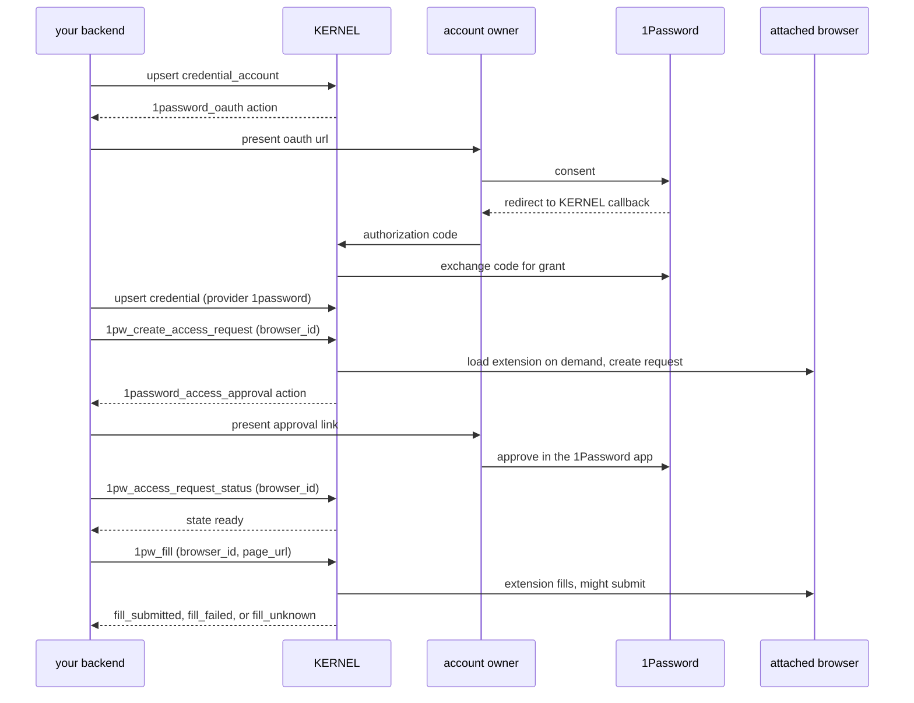

**status:** <Badge color="yellow">preview</Badge>

a vault-attached browser can get a login from two places. KERNEL can host a
collection form and store the values in a `credential` item, or a user can
approve access to a login that stays in their 1Password account.

<Warning>
  1Password brokered approval isn't generally available. hosted KERNEL
  environments return `503` with code `provider_unavailable` for
  `1pw_create_access_request`, `1pw_access_request_status`, and `1pw_fill`,
  even when an item advertises them. KERNEL-hosted credential collection is
  unaffected.
</Warning>

{/* TODO(1password-sdk-preview): samples on this page were typechecked against the unreleased stlc sdk preview for kernel/kernel@edb30b1 (node kernel-node-sdk-staging@b9931e0, python kernel-python-sdk-staging@7ec177f). re-check them against the first published sdk release that includes 1Password vault items before or right after merge. */}

## Choose a path

use KERNEL-hosted collection when KERNEL can hold an encrypted copy of the
credential. use 1Password brokered approval when the credential must stay in
the user's 1Password account and the user wants to approve each request in the
1Password app.

| | KERNEL-hosted collection | 1Password brokered approval |
| --- | --- | --- |
| where values live | encrypted in a KERNEL `credential` item | in the user's 1Password account; KERNEL stores an encrypted approval reference, not the values |
| items | one `credential` item with `provider: "kernel"` | a `credential_account` item for the connection, plus a `credential` item with `provider: "1password"` per login |
| human step | enter values in a KERNEL-hosted form | approve once with oauth to connect, then approve each access request in the 1Password app |
| browser operation | [`fill`](/vaults/fill): your controller supplies field names and selectors | `1pw_fill`: the 1Password extension selects the fields; you supply only the page url |
| submission | `fill` never submits the form | `1pw_fill` fills the form and might submit it |
| destination check | your controller authorizes the destination | the page must share the origin of the requested website |
| totp | KERNEL generates codes from a stored seed | not configurable through KERNEL; the extension decides what to fill |
| availability | preview | preview; not enabled in hosted environments |

neither path confirms that the website accepted the login. check the page after
filling.

## KERNEL-hosted credential collection

define a `credential` item with `provider: "kernel"` and the fields your
website needs. if required values are missing, the item returns a `collect`
action. present `action.url` to the user, wait for `ready`, then invoke
[`fill`](/vaults/fill).

<CodeGroup>

```typescript TypeScript
const item = await kernel.vaults.items.upsert("portal-login", {
  id_or_name: vault.id,
  type: "credential",
  spec: {
    provider: "kernel",
    description: "Account Portal",
    fields: [
      { name: "username", label: "Email address", type: "email", sensitive: false },
      { name: "password", label: "Password", type: "password" },
    ],
  },
});
```

```python Python
item = kernel.vaults.items.upsert(
    "portal-login",
    id_or_name=vault.id,
    type="credential",
    spec={
        "provider": "kernel",
        "description": "Account Portal",
        "fields": [
            {"name": "username", "label": "Email address", "type": "email", "sensitive": False},
            {"name": "password", "label": "Password", "type": "password"},
        ],
    },
)
```

</CodeGroup>

see [credential items](/vaults/credentials) for field rules, collection links,
updates, and totp.

## 1Password brokered approval

brokered approval has three phases: connect the user's 1Password account once,
define the login you need, then request, approve, and fill it in a
vault-attached browser.



### Connect a 1Password account

create a `credential_account` item in the user's vault. it returns
`state.status: "pending_authorization"` and an `action` named
`1password_oauth`. present `action.url` to the signed-in user in your
application, outside the agent-controlled browser. the user signs in to
1Password and approves the connection.

<CodeGroup>

```typescript TypeScript
let account = await kernel.vaults.items.upsert("1password-account", {
  id_or_name: vault.id,
  type: "credential_account",
  spec: {
    provider: "1password",
    authorization: { method: "oauth", client: { type: "kernel_managed" } },
  },
});
if (account.type !== "credential_account") {
  throw new Error("unexpected item type");
}
if (account.action?.name === "1password_oauth") {
  // Present account.action.url to the signed-in user in your application.
}

account = await kernel.vaults.items.retrieve("1password-account", {
  id_or_name: vault.id,
  wait: 60,
});
if (account.type !== "credential_account" || account.state.status !== "connected") {
  throw new Error("1Password account isn't connected");
}
```

```python Python
account = kernel.vaults.items.upsert(
    "1password-account",
    id_or_name=vault.id,
    type="credential_account",
    spec={
        "provider": "1password",
        "authorization": {"method": "oauth", "client": {"type": "kernel_managed"}},
    },
)
if account.type != "credential_account":
    raise RuntimeError("unexpected item type")
if account.action is not None and account.action.name == "1password_oauth":
    pass  # Present account.action.url to the signed-in user in your application.

account = kernel.vaults.items.retrieve("1password-account", id_or_name=vault.id, wait=60)
if account.type != "credential_account" or account.state.status != "connected":
    raise RuntimeError("1Password account isn't connected")
```

</CodeGroup>

KERNEL receives the oauth callback, exchanges the code, and stores the
connection encrypted. the api never returns tokens or other connection
secrets.

| `state.status` | meaning | next step |
| --- | --- | --- |
| `pending_authorization` | waiting for consent | present `action.url`; read with `wait` |
| `connected` | the connection is usable | define credential items |
| `declined` | the user declined consent | repeat the upsert to get a new authorization url, or use `1pw_recover` when it's advertised |
| `reconnect_required` | the connection needs reauthorization; `state.status_reason` explains why | repeat the upsert, or use `1pw_recover` when it's advertised |

the authorization url expires after 15 minutes. repeating the same upsert
returns the current url while it's valid and issues a new one after it
expires. a `wait` read keeps holding while the status is
`reconnect_required`, so check the status instead of waiting for it to change.

#### Use your own OAuth client

by default, KERNEL's oauth client connects the account. to use your own
1Password oauth client, register it as an organization-scoped [provider
configuration](/integrations/wallets/overview#provider-configurations), then
register the returned `redirect_uri` with 1Password before connecting accounts.

<CodeGroup>

```typescript TypeScript
const config = await kernel.vaultProviderConfigs.create({
  name: "acme-1password",
  provider: "1password",
  credentials: {
    client_id: process.env.ONEPASSWORD_CLIENT_ID!,
    client_secret: process.env.ONEPASSWORD_CLIENT_SECRET!,
  },
});
if (config.provider !== "1password") throw new Error("unexpected provider");
console.log(config.redirect_uri); // register this exact url with 1Password

await kernel.vaults.items.upsert("1password-account", {
  id_or_name: vault.id,
  type: "credential_account",
  spec: {
    provider: "1password",
    authorization: {
      method: "oauth",
      client: { type: "customer_managed", provider_config: { name: "acme-1password" } },
    },
  },
});
```

```python Python
config = kernel.vault_provider_configs.create(
    name="acme-1password",
    provider="1password",
    credentials={
        "client_id": os.environ["ONEPASSWORD_CLIENT_ID"],
        "client_secret": os.environ["ONEPASSWORD_CLIENT_SECRET"],
    },
)
if config.provider != "1password":
    raise RuntimeError("unexpected provider")
print(config.redirect_uri)  # register this exact url with 1Password

kernel.vaults.items.upsert(
    "1password-account",
    id_or_name=vault.id,
    type="credential_account",
    spec={
        "provider": "1password",
        "authorization": {
            "method": "oauth",
            "client": {"type": "customer_managed", "provider_config": {"name": "acme-1password"}},
        },
    },
)
```

</CodeGroup>

{/* TODO(1password-byo-oauth): the ownership of the redirect uri and oauth grant for customer-owned clients is under design review. update this section when the contract is decided; don't document the proposed out-of-band integration as available until it ships. */}

today, KERNEL owns the redirect uri and the grant for customer-owned clients
too. KERNEL receives the callback and stores the connection; you can't import
tokens that your application obtained. the account binds to
the configuration's immutable id, so renaming the configuration keeps the
binding, and an account can't switch configurations.

<Note>
  this contract is under review. an alternative in which your application
  owns the redirect and grant and supplies them to KERNEL out of band has been
  proposed, but it isn't available and its shape isn't final. this section
  might change.
</Note>

### Define a login request

create a `credential` item with `provider: "1password"`. `account_id` must be
the id of a connected `credential_account` in the same vault. `requests` uses
1Password's version 2 credential request format with exactly one `login`
entry and an https `website`. the item stores no values or selectors.

<CodeGroup>

```typescript TypeScript
const credential = await kernel.vaults.items.upsert("github-login", {
  id_or_name: vault.id,
  type: "credential",
  spec: {
    provider: "1password",
    account_id: account.id,
    requests: {
      version: 2,
      goal: "Review open pull requests",
      entries: [
        {
          type: "login",
          parameters: { website: "https://github.com" },
          reason: "Sign in to GitHub",
        },
      ],
    },
  },
});
```

```python Python
credential = kernel.vaults.items.upsert(
    "github-login",
    id_or_name=vault.id,
    type="credential",
    spec={
        "provider": "1password",
        "account_id": account.id,
        "requests": {
            "version": 2,
            "goal": "Review open pull requests",
            "entries": [
                {
                    "type": "login",
                    "parameters": {"website": "https://github.com"},
                    "reason": "Sign in to GitHub",
                }
            ],
        },
    },
)
```

</CodeGroup>

`goal` accepts up to 140 characters, `reason` up to 100, and an entry can
include one to five `keywords` of up to 50 characters each. the new item starts
in `pending_authorization` and advertises `1pw_create_access_request`. the account,
website, and request are immutable; use a new item key for a different login.
the deprecated `website` shorthand is still accepted, but supply `requests`
for new items.

### Request access and hand off approval

create a browser with the vault attached, then invoke
`1pw_create_access_request` with its `browser_id`. you don't install anything:
KERNEL loads the 1Password extension into that browser on demand the first time
an operation needs it, then creates the access request through the extension
with the connected account. `goal`, `reason`, and `keywords` in the operation
override the item's values for this request.

<CodeGroup>

```typescript TypeScript
const browser = await kernel.browsers.create({ vaults: [{ id: vault.id }] });

const requested = await kernel.vaults.items.performOperation("github-login", {
  id_or_name: vault.id,
  type: "1pw_create_access_request",
  browser_id: browser.session_id,
});
if (requested.type !== "credential" || requested.action?.name !== "1password_access_approval") {
  throw new Error("1Password didn't return an approval link");
}
// Present requested.action.url to the account owner. Don't modify it.
```

```python Python
browser = kernel.browsers.create(vaults=[{"id": vault.id}])

requested = kernel.vaults.items.perform_operation(
    "github-login",
    id_or_name=vault.id,
    type="1pw_create_access_request",
    browser_id=browser.session_id,
)
if (requested.type != "credential" or requested.action is None or
        requested.action.name != "1password_access_approval"):
    raise RuntimeError("1Password didn't return an approval link")
# Present requested.action.url to the account owner. Don't modify it.
```

</CodeGroup>

the response returns an `action` named `1password_access_approval`. its `url`
is a native `onepassword://grant-brokered-access` link and `instructions`
describes the handoff. present the link to the end user who owns the 1Password
account. they open it on a device with the 1Password app, choose the login,
and approve or deny there. the link grants nothing until they approve. don't
issue a second request while one is pending.

`state.access_request` reports non-secret request state, such as its `id`,
`state`, `granted_count`, and whether a fillable reference exists
(`has_autofill_token`). other fields are echoed from 1Password's response when
it supplies them.

don't automatically retry a failed request. if the call fails before KERNEL
dispatches the request to 1Password, the item still advertises
`1pw_create_access_request`. if it fails after dispatch, the outcome is
uncertain: a request might exist in 1Password. the item stays blocked in
`pending_authorization` with no approval action and no available operations,
and KERNEL doesn't offer a way to retry or reset it. ask the account owner to
check the 1Password app for a pending request instead of sending another.

### Poll for the decision

after you present the approval link, invoke `1pw_access_request_status` with a
vault-attached `browser_id` until the status leaves `pending_authorization`.
`timeout_seconds` accepts 0–120 and defaults to 10. KERNEL records the decision only when you poll; a `wait` read of the item
doesn't observe approval.

<CodeGroup>

```typescript TypeScript
let item: Kernel.Vaults.VaultItemOperationResponse = requested;
while (item.type === "credential" && item.state.status === "pending_authorization") {
  item = await kernel.vaults.items.performOperation("github-login", {
    id_or_name: vault.id,
    type: "1pw_access_request_status",
    browser_id: browser.session_id,
    timeout_seconds: 60,
  });
}
if (item.type !== "credential" || item.state.status !== "ready") {
  throw new Error("1Password access wasn't granted");
}
```

```python Python
item = requested
while item.type == "credential" and item.state.status == "pending_authorization":
    item = kernel.vaults.items.perform_operation(
        "github-login",
        id_or_name=vault.id,
        type="1pw_access_request_status",
        browser_id=browser.session_id,
        timeout_seconds=60,
    )
if item.type != "credential" or item.state.status != "ready":
    raise RuntimeError("1Password access wasn't granted")
```

</CodeGroup>

| request state | item `state.status` | result |
| --- | --- | --- |
| `pending` | `pending_authorization` | the approval action remains; poll again |
| `resolved` | `ready` | the approval action is removed and `1pw_fill` is advertised |
| `denied` | `declined` | no reference is kept |
| `failed` | `failed` | no reference is kept |

`declined` and `failed` are final for the item. delete it or use a new key to
request again. if 1Password resolves a request without exactly one matching
login, polling returns `409`; inspect the request in 1Password before polling
again. the approved reference stays encrypted and is only usable by `1pw_fill`.
`ready` means an approval was recorded, not that 1Password will honor it
indefinitely.

### Fill and submit

navigate the attached browser to the login page, then invoke `1pw_fill` with
the browser's session id and the exact current top-level `page_url`. the url
must match exactly one open page and share the origin of the requested
website. the extension selects and fills the fields and might submit the form;
you can't supply selectors or values. a submitted form doesn't mean the login
succeeded.

<CodeGroup>

```typescript TypeScript
const result = await kernel.vaults.items.performOperation("github-login", {
  id_or_name: vault.id,
  type: "1pw_fill",
  browser_id: browser.session_id,
  page_url: "https://github.com/login",
});
if (result.type !== "1pw_fill") throw new Error("unexpected operation response");
if (result.status === "fill_failed") {
  console.log(result.error_code);
}
```

```python Python
result = kernel.vaults.items.perform_operation(
    "github-login",
    id_or_name=vault.id,
    type="1pw_fill",
    browser_id=browser.session_id,
    page_url="https://github.com/login",
)
if result.type != "1pw_fill":
    raise RuntimeError("unexpected operation response")
if result.status == "fill_failed":
    print(result.error_code)
```

</CodeGroup>

`timeout_ms` accepts 1–30,000 and defaults to 30,000.

| outcome | meaning | next step |
| --- | --- | --- |
| `200` `fill_submitted` | the extension filled and submitted the form | check the page; website authentication isn't verified |
| `200` `fill_failed` | the extension reported `fillFailed`, `autosubmitFailed`, `noExistingCredentials`, or `authenticationFailed` | inspect the page before trying again |
| `200` `fill_unknown` | the fill was dispatched but the outcome is inconclusive; it might have submitted | check the page; don't retry in the same browser |
| `400` `page_not_found` or `ambiguous_page` | `page_url` matched no page or more than one | fix the url or close duplicate tabs |
| `400` `invalid_request` | the fill request was rejected as invalid | check `browser_id`, `page_url`, and `timeout_ms` before trying again |
| `403` `destination_denied` | the page is outside the approved login origin | navigate to the requested website |
| `409` | the item isn't `ready` or its approval is unusable | retrieve the item and follow `available_operations` |

### Recover a failed account link

if linking the account fails in a way KERNEL can recover from, the
`credential_account` advertises `1pw_recover` and `state.status_reason`
describes the failure. invoke it to get a new `1password_oauth` action, and
present its `url` to the user as you did when connecting. after recovery
completes, start a new authorization on the same item by repeating the account
upsert. don't delete the account to recover, and don't retry recovery
automatically.

### Delete items

delete a 1Password `credential` item to discard its approval reference. delete
every `credential` item that references an account before deleting the
`credential_account`; otherwise the api returns `409`. deleting the account
removes KERNEL's stored grant. it doesn't remove the connection from the
user's 1Password account.

## Limitations

- **not enabled in hosted environments:** request, poll, and fill return `503` `provider_unavailable`. the current implementation runs only in development environments; production browser isolation for the extension isn't implemented.
- **not secret isolation:** for each access request, status check, and fill, KERNEL gives the extension inside the attached browser access to the connected account, and it doesn't remove the extension afterward. use a dedicated browser for 1Password operations and don't give untrusted automation concurrent access to its cdp endpoint, page scripts, or extensions. after filling, page content is readable like any other form input.
- **one login per item:** each `credential` item carries one request entry for one https website.
- **submission isn't authentication:** `fill_submitted` means the form was submitted, not that the login succeeded. confirm the result on the page.
- **no automatic retries:** access requests, recovery, and inconclusive fills can have effects in 1Password or on the website. an access request with an uncertain outcome stays blocked; don't send another automatically.

## Related

- [vaults overview](/vaults/overview): resource model, scope, and browser attachment.
- [credential items](/vaults/credentials): KERNEL-hosted collection.
- [fill browser fields](/vaults/fill): selector-based fill for KERNEL credentials.
- [1Password for managed auth](/integrations/1password): a separate integration that reads 1Password items with a service account during managed auth logins.
