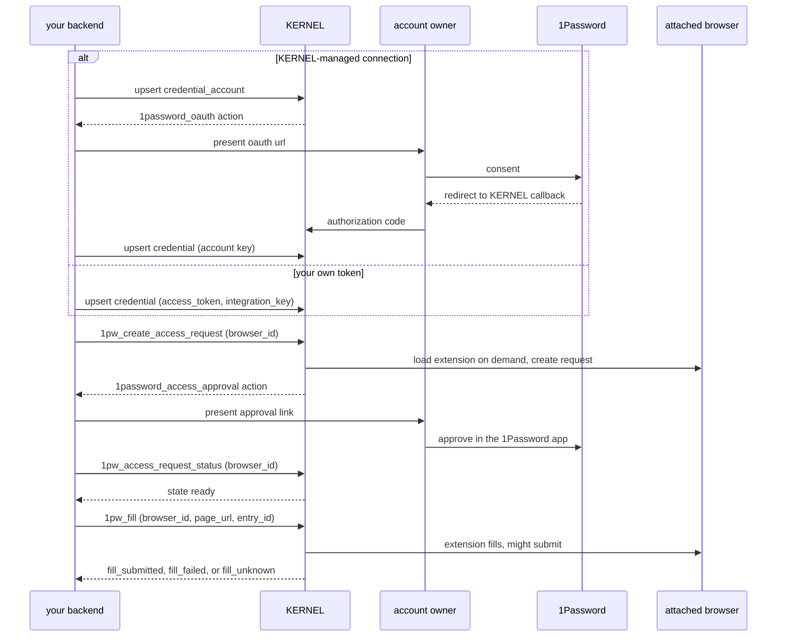

**status:** <Badge color="yellow">preview</Badge>

a vault-attached browser can get a login from two places. KERNEL can host a
collection form and store the values in a `credential` item, or a user can
approve access to logins that stay in their 1Password account.

{/* TODO(1password-sdk-preview): written against kernel/kernel@24c5c86. no stlc sdk preview exists for that commit yet. the account-backed samples were typechecked against the preview for kernel/kernel@fe87a59 (node kernel-node-sdk-staging@5042ab6, python kernel-python-sdk-staging@9cfd4ae), whose vault item types match 24c5c86 except for stored-token fields. the stored-token create and `1pw_update_access_token` samples were validated only against the 24c5c86 openapi schema. re-typecheck every sample against the first published sdk release that includes 1Password vault items before or right after merge. */}

## Choose a path

use KERNEL-hosted collection when KERNEL can hold an encrypted copy of the
credential. use 1Password brokered approval when the credential must stay in
the user's 1Password account and the user wants to approve each request in the
1Password app.

| | KERNEL-hosted collection | 1Password brokered approval |
| --- | --- | --- |
| where values live | encrypted in a KERNEL `credential` item | in the user's 1Password account; KERNEL stores encrypted approval references, not the values |
| items | one `credential` item with `provider: "kernel"` | a `credential` item with `provider: "1password"`, backed by a connected `credential_account` or by an access token and integration key you supply |
| human step | enter values in a KERNEL-hosted form | approve each access request in the 1Password app; a connected account also needs a one-time oauth consent |
| browser operation | [`fill`](/vaults/fill): your controller supplies field names and selectors | `1pw_fill`: the 1Password extension selects the fields; you supply the page url |
| submission | `fill` never submits the form | `1pw_fill` fills the form and might submit it |
| destination check | your controller authorizes the destination | the page must share the origin of an approved login |
| totp | KERNEL generates codes from a stored seed | not configurable through KERNEL; the extension decides what to fill |
| availability | preview | preview |

neither path confirms that the website accepted the login. check the page after
filling.

## KERNEL-hosted credential collection

define a `credential` item with `provider: "kernel"` and the fields your
website needs. if required values are missing, the item returns a `collect`
action. present `action.url` to the user, wait for `ready`, then invoke
[`fill`](/vaults/fill).

<CodeGroup>

```typescript TypeScript
const item = await kernel.vaults.items.upsert("portal-login", {
  id_or_name: vault.id,
  type: "credential",
  spec: {
    provider: "kernel",
    description: "Account Portal",
    fields: [
      { name: "username", label: "Email address", type: "email", sensitive: false },
      { name: "password", label: "Password", type: "password" },
    ],
  },
});
```

```python Python
item = kernel.vaults.items.upsert(
    "portal-login",
    id_or_name=vault.id,
    type="credential",
    spec={
        "provider": "kernel",
        "description": "Account Portal",
        "fields": [
            {"name": "username", "label": "Email address", "type": "email", "sensitive": False},
            {"name": "password", "label": "Password", "type": "password"},
        ],
    },
)
```

</CodeGroup>

see [credential items](/vaults/credentials) for field rules, collection links,
updates, and totp.

## 1Password brokered approval

brokered approval has three phases: give KERNEL a way to reach the user's
1Password account, define the logins you need, then request, approve, and fill
them in a vault-attached browser.


```mermaid
sequenceDiagram
  participant App as your backend
  participant K as KERNEL
  participant U as account owner
  participant OP as 1Password
  participant B as attached browser
  alt KERNEL-managed connection
    App->>K: upsert credential_account
    K-->>App: 1password_oauth action
    App->>U: present oauth url
    U->>OP: consent
    OP-->>U: redirect to KERNEL callback
    U->>K: authorization code
    App->>K: upsert credential (account key)
  else your own token
    App->>K: upsert credential (access_token, integration_key)
  end
  App->>K: 1pw_create_access_request (browser_id)
  K->>B: load extension on demand, create request
  K-->>App: 1password_access_approval action
  App->>U: present approval link
  U->>OP: approve in the 1Password app
  App->>K: 1pw_access_request_status (browser_id)
  K-->>App: state ready
  App->>K: 1pw_fill (browser_id, page_url, entry_id)
  K->>B: extension fills, might submit
  K-->>App: fill_submitted, fill_failed, or fill_unknown
```

a 1Password `credential` item reaches 1Password in one of two ways. choose one
when you create the item; you can't switch an item between them.

| | connected account | your own token |
| --- | --- | --- |
| spec | `account`: the key of a `credential_account` item in the same vault | `access_token` and `integration_key` that your application obtained for the user |
| who holds the connection | KERNEL, after the user consents with oauth | you; KERNEL stores both values encrypted on the credential item |
| expiry and rotation | KERNEL maintains the connection; use `1pw_recover` when it's advertised | you track expiry and replace the token with `1pw_update_access_token` |
| reuse | one account backs many credential items | each credential item stores its own token and key |

### Connect a 1Password account

create a `credential_account` item in the user's vault. it returns
`state.status: "pending_authorization"` and an `action` named
`1password_oauth`. present `action.url` to the signed-in user in your
application, outside the agent-controlled browser. the user signs in to
1Password and approves the connection. KERNEL's oauth client performs the
connection; accounts don't accept a custom oauth client.

<CodeGroup>

```typescript TypeScript
let account = await kernel.vaults.items.upsert("1password-account", {
  id_or_name: vault.id,
  type: "credential_account",
  spec: {
    provider: "1password",
    authorization: { method: "oauth", client: { type: "kernel_managed" } },
  },
});
if (account.type !== "credential_account") {
  throw new Error("unexpected item type");
}
if (account.action?.name === "1password_oauth") {
  // Present account.action.url to the signed-in user in your application.
}

account = await kernel.vaults.items.retrieve("1password-account", {
  id_or_name: vault.id,
  wait: 60,
});
if (account.type !== "credential_account" || account.state.status !== "connected") {
  throw new Error("1Password account isn't connected");
}
```

```python Python
account = kernel.vaults.items.upsert(
    "1password-account",
    id_or_name=vault.id,
    type="credential_account",
    spec={
        "provider": "1password",
        "authorization": {"method": "oauth", "client": {"type": "kernel_managed"}},
    },
)
if account.type != "credential_account":
    raise RuntimeError("unexpected item type")
if account.action is not None and account.action.name == "1password_oauth":
    pass  # Present account.action.url to the signed-in user in your application.

account = kernel.vaults.items.retrieve("1password-account", id_or_name=vault.id, wait=60)
if account.type != "credential_account" or account.state.status != "connected":
    raise RuntimeError("1Password account isn't connected")
```

</CodeGroup>

KERNEL receives the oauth callback, exchanges the code, and stores the
connection encrypted. the api never returns tokens or other connection
secrets.

| `state.status` | meaning | next step |
| --- | --- | --- |
| `pending_authorization` | waiting for consent | present `action.url`; read with `wait` |
| `connected` | the connection is usable | define credential items |
| `declined` | the user declined consent | repeat the upsert to get a new authorization url, or use `1pw_recover` when it's advertised |
| `reconnect_required` | the connection needs reauthorization; `state.status_reason` explains why | repeat the upsert, or use `1pw_recover` when it's advertised |

the authorization url expires after a short time. repeating the same upsert
returns the current url while it's valid and issues a new one after it
expires. a `wait` read keeps holding while the status is
`reconnect_required`, so check the status instead of waiting for it to change.

#### Recover a failed account link

if linking the account fails in a way KERNEL can recover from, the
`credential_account` advertises `1pw_recover` and `state.status_reason`
describes the failure. invoke it to get a new `1password_oauth` action, and
present its `url` to the user as you did when connecting. after recovery
completes, start a new authorization on the same item by repeating the account
upsert. don't delete the account to recover, and don't retry recovery
automatically.

### Define a login request

create a `credential` item with `provider: "1password"` and `account` set to
the key of a connected `credential_account` in the same vault. the item stores
the account's key, not its id, and returns it in `spec.account`. `requests`
uses 1Password's version 2 credential request format with one to five `login`
entries, each with an https `website`. the item stores no values or selectors.

<CodeGroup>

```typescript TypeScript
const credential = await kernel.vaults.items.upsert("github-login", {
  id_or_name: vault.id,
  type: "credential",
  spec: {
    provider: "1password",
    account: "1password-account",
    requests: {
      version: 2,
      goal: "Review open pull requests",
      entries: [
        {
          type: "login",
          parameters: { website: "https://github.com" },
          reason: "Sign in to GitHub",
        },
      ],
    },
  },
});
```

```python Python
credential = kernel.vaults.items.upsert(
    "github-login",
    id_or_name=vault.id,
    type="credential",
    spec={
        "provider": "1password",
        "account": "1password-account",
        "requests": {
            "version": 2,
            "goal": "Review open pull requests",
            "entries": [
                {
                    "type": "login",
                    "parameters": {"website": "https://github.com"},
                    "reason": "Sign in to GitHub",
                }
            ],
        },
    },
)
```

</CodeGroup>

`goal` accepts up to 140 characters, each entry's `reason` up to 100, and an
entry can include one to five `keywords` of up to 50 characters each. the new
item starts in `pending_authorization` and advertises
`1pw_create_access_request`. the source, account, and requests are immutable;
repeating the same upsert returns the current item, and a different spec at
the same key returns `409`. use a new item key for different logins. the
deprecated `website` shorthand is still accepted for account-backed items, but
supply `requests` for new items.

#### Use your own access token

instead of `account`, supply an `access_token` and the matching
`integration_key` that your application obtained from 1Password for the user.
KERNEL checks that they belong together, stores both encrypted on this item,
and never returns either. `access_token_expires_at` is optional metadata; it
must be in the future, and the item returns it in
`spec.access_token_expires_at`. stored-token items require `requests`.

<CodeGroup>

```typescript TypeScript
const credential = await kernel.vaults.items.upsert("github-login", {
  id_or_name: vault.id,
  type: "credential",
  spec: {
    provider: "1password",
    access_token: process.env.ONEPASSWORD_ACCESS_TOKEN!,
    integration_key: process.env.ONEPASSWORD_INTEGRATION_KEY!,
    access_token_expires_at: "2026-12-31T00:00:00Z",
    requests: {
      version: 2,
      entries: [{ type: "login", parameters: { website: "https://github.com" } }],
    },
  },
});
```

```python Python
credential = kernel.vaults.items.upsert(
    "github-login",
    id_or_name=vault.id,
    type="credential",
    spec={
        "provider": "1password",
        "access_token": os.environ["ONEPASSWORD_ACCESS_TOKEN"],
        "integration_key": os.environ["ONEPASSWORD_INTEGRATION_KEY"],
        "access_token_expires_at": "2026-12-31T00:00:00Z",
        "requests": {
            "version": 2,
            "entries": [{"type": "login", "parameters": {"website": "https://github.com"}}],
        },
    },
)
```

</CodeGroup>

supply `account` or both secrets, never both; a mismatched or incomplete pair
returns `400`. repeating the create with identical values returns the current
item. a create at the same key with a different token, key, expiry, or
requests returns `409`, so don't use the upsert to rotate the token. after
`access_token_expires_at` passes, the item stops advertising
`1pw_create_access_request`, `1pw_access_request_status`, and `1pw_fill`, and
`1pw_fill` returns `409` until you replace the token. KERNEL doesn't obtain or
refresh a supplied token.

#### Replace a stored access token

invoke `1pw_update_access_token` with the new `access_token`. the new token
must match the stored integration key. the operation replaces only the token:
the integration key, requests, pending access request, approved references,
and `state.status` stay as they were. set `access_token_expires_at` to record
the new expiry, or omit it to clear the old one.

<CodeGroup>

```typescript TypeScript
await kernel.vaults.items.performOperation("github-login", {
  id_or_name: vault.id,
  type: "1pw_update_access_token",
  access_token: process.env.ONEPASSWORD_ACCESS_TOKEN!,
  access_token_expires_at: "2027-03-31T00:00:00Z",
});
```

```python Python
kernel.vaults.items.perform_operation(
    "github-login",
    id_or_name=vault.id,
    type="1pw_update_access_token",
    access_token=os.environ["ONEPASSWORD_ACCESS_TOKEN"],
    access_token_expires_at="2027-03-31T00:00:00Z",
)
```

</CodeGroup>

stored-token items advertise `1pw_update_access_token` whenever no other
1Password operation is in progress; during one, it returns `409`. updating the
token doesn't contact 1Password and doesn't retry a pending or uncertain
operation.

#### Request several logins

a `requests` object can hold up to five `login` entries, so one approval can
cover several logins. the user can approve some entries and not others. when
approved entries share an origin, pass `entry_id` to `1pw_fill` to choose one.
`reason` and `keywords` overrides at request time work only when the item has a
single entry.

<CodeGroup>

```typescript TypeScript
await kernel.vaults.items.upsert("example-portal-logins", {
  id_or_name: vault.id,
  type: "credential",
  spec: {
    provider: "1password",
    account: "1password-account",
    requests: {
      version: 2,
      goal: "Reconcile this month's invoices",
      entries: [
        {
          type: "login",
          parameters: { website: "https://portal.example.com/billing" },
          reason: "Download invoices",
        },
        {
          type: "login",
          parameters: { website: "https://portal.example.com/admin" },
          reason: "Update payment settings",
        },
      ],
    },
  },
});
```

```python Python
kernel.vaults.items.upsert(
    "example-portal-logins",
    id_or_name=vault.id,
    type="credential",
    spec={
        "provider": "1password",
        "account": "1password-account",
        "requests": {
            "version": 2,
            "goal": "Reconcile this month's invoices",
            "entries": [
                {
                    "type": "login",
                    "parameters": {"website": "https://portal.example.com/billing"},
                    "reason": "Download invoices",
                },
                {
                    "type": "login",
                    "parameters": {"website": "https://portal.example.com/admin"},
                    "reason": "Update payment settings",
                },
            ],
        },
    },
)
```

</CodeGroup>

### Request access and hand off approval

create a browser with the vault attached, then invoke
`1pw_create_access_request` with its `browser_id`. you don't install anything:
KERNEL loads the 1Password extension into that browser on demand the first time
an operation needs it, then creates the access request through the extension.
`goal`, `reason`, and `keywords` in the operation override the item's values
for this request.

<CodeGroup>

```typescript TypeScript
const browser = await kernel.browsers.create({ vaults: [{ id: vault.id }] });

const requested = await kernel.vaults.items.performOperation("github-login", {
  id_or_name: vault.id,
  type: "1pw_create_access_request",
  browser_id: browser.session_id,
});
if (requested.type !== "credential" || requested.action?.name !== "1password_access_approval") {
  throw new Error("1Password didn't return an approval link");
}
// Present requested.action.url to the account owner. Don't modify it.
```

```python Python
browser = kernel.browsers.create(vaults=[{"id": vault.id}])

requested = kernel.vaults.items.perform_operation(
    "github-login",
    id_or_name=vault.id,
    type="1pw_create_access_request",
    browser_id=browser.session_id,
)
if (requested.type != "credential" or requested.action is None or
        requested.action.name != "1password_access_approval"):
    raise RuntimeError("1Password didn't return an approval link")
# Present requested.action.url to the account owner. Don't modify it.
```

</CodeGroup>

the response returns an `action` named `1password_access_approval`. its `url`
is a native `onepassword://grant-brokered-access` link and `instructions`
describes the handoff. present the link to the end user who owns the 1Password
account. they open it on a device with the 1Password app, choose the logins,
and approve or deny there. the link grants nothing until they approve. don't
issue a second request while one is pending.

`state.access_request` reports non-secret request state, such as its `id`,
`state`, `entries`, `granted_count`, and whether a fillable reference exists
(`has_autofill_token`). other fields are echoed from 1Password's response when
it supplies them.

don't automatically retry a failed request. if the call fails before KERNEL
dispatches the request to 1Password, the item still advertises
`1pw_create_access_request`. if it fails after dispatch, the outcome is
uncertain: a request might exist in 1Password. the item stays blocked in
`pending_authorization` with no approval action and no available operations,
and KERNEL doesn't offer a way to retry or reset it. ask the account owner to
check the 1Password app for a pending request instead of sending another.

### Poll for the decision

after you present the approval link, invoke `1pw_access_request_status` with a
vault-attached `browser_id` until the status leaves `pending_authorization`.
`timeout_seconds` accepts 0–120 and defaults to 10. KERNEL records the decision
only when you poll; a `wait` read of the item doesn't observe approval.

<CodeGroup>

```typescript TypeScript
let item: Kernel.Vaults.VaultItemOperationResponse = requested;
while (item.type === "credential" && item.state.status === "pending_authorization") {
  item = await kernel.vaults.items.performOperation("github-login", {
    id_or_name: vault.id,
    type: "1pw_access_request_status",
    browser_id: browser.session_id,
    timeout_seconds: 60,
  });
}
if (item.type !== "credential" || item.state.status !== "ready") {
  throw new Error("1Password access wasn't granted");
}
```

```python Python
item = requested
while item.type == "credential" and item.state.status == "pending_authorization":
    item = kernel.vaults.items.perform_operation(
        "github-login",
        id_or_name=vault.id,
        type="1pw_access_request_status",
        browser_id=browser.session_id,
        timeout_seconds=60,
    )
if item.type != "credential" or item.state.status != "ready":
    raise RuntimeError("1Password access wasn't granted")
```

</CodeGroup>

| request state | item `state.status` | result |
| --- | --- | --- |
| `pending` | `pending_authorization` | the approval action remains; poll again |
| `resolved` | `ready` | the approval action is removed and `1pw_fill` is advertised |
| `denied` | `declined` | no reference is kept |
| `failed` | `failed` | no reference is kept |

`declined` and `failed` are final for the item; use a new key to request
again. an item with several entries also moves to `failed` if 1Password
doesn't report which approved login belongs to which website;
`state.status_reason` then recommends separate credential items. if
1Password resolves a single-entry request without exactly one matching login,
polling returns `409`; inspect the request in 1Password before polling again.
approved references stay encrypted and are only usable by `1pw_fill`. `ready`
means an approval was recorded, not that 1Password will honor it
indefinitely.

### Fill and submit

navigate the attached browser to the login page, then invoke `1pw_fill` with
the browser's session id and the exact current top-level `page_url`. the url
must match exactly one open page and share the origin of an approved entry.
when more than one approved entry has that origin, pass its `entry_id` from
`state.access_request.entries`. the extension selects and fills the fields and
might submit the form; you can't supply selectors or values. a submitted form
doesn't mean the login succeeded.

while `1pw_fill` runs, KERNEL blocks inbound control surfaces for that browser,
such as CDP connections and browser API calls. this doesn't cover live view
input or other direct access to the browser VM.

<CodeGroup>

```typescript TypeScript
const approved = await kernel.vaults.items.retrieve("example-portal-logins", {
  id_or_name: vault.id,
});
if (approved.type !== "credential" || approved.state.provider !== "1password") {
  throw new Error("unexpected item");
}
const billing = approved.state.access_request?.entries?.find(
  (entry) => entry.parameters?.website === "https://portal.example.com/billing",
);
if (!billing?.id) throw new Error("the billing login wasn't requested");

const result = await kernel.vaults.items.performOperation("example-portal-logins", {
  id_or_name: vault.id,
  type: "1pw_fill",
  browser_id: browser.session_id,
  page_url: "https://portal.example.com/login",
  entry_id: billing.id,
});
if (result.type !== "1pw_fill") throw new Error("unexpected operation response");
if (result.status === "fill_failed") {
  console.log(result.error_code);
}
```

```python Python
approved = kernel.vaults.items.retrieve("example-portal-logins", id_or_name=vault.id)
if approved.type != "credential" or approved.state.provider != "1password":
    raise RuntimeError("unexpected item")
entries = approved.state.access_request.entries if approved.state.access_request else None
billing = next(
    (e for e in entries or [] if e.parameters and e.parameters.website == "https://portal.example.com/billing"),
    None,
)
if billing is None or billing.id is None:
    raise RuntimeError("the billing login wasn't requested")

result = kernel.vaults.items.perform_operation(
    "example-portal-logins",
    id_or_name=vault.id,
    type="1pw_fill",
    browser_id=browser.session_id,
    page_url="https://portal.example.com/login",
    entry_id=billing.id,
)
if result.type != "1pw_fill":
    raise RuntimeError("unexpected operation response")
if result.status == "fill_failed":
    print(result.error_code)
```

</CodeGroup>

for an item with one entry, omit `entry_id`. `timeout_ms` accepts 1–30,000 and
defaults to 30,000.

| outcome | meaning | next step |
| --- | --- | --- |
| `200` `fill_submitted` | the extension filled and submitted the form | check the page; website authentication isn't verified |
| `200` `fill_failed` | the extension reported `fillFailed`, `autosubmitFailed`, `noExistingCredentials`, or `authenticationFailed` | inspect the page before trying again |
| `200` `fill_unknown` | the fill was dispatched but the outcome is inconclusive; it might have submitted | check the page; don't retry in the same browser |
| `400` `page_not_found` or `ambiguous_page` | `page_url` matched no page or more than one | fix the url or close duplicate tabs |
| `400` `invalid_request` | the fill request was rejected as invalid | check `browser_id`, `page_url`, and `timeout_ms` before trying again |
| `403` `destination_denied` | the page is outside every approved login origin | navigate to a requested website |
| `409` | the item isn't `ready`, its approval is unusable, `entry_id` is missing or doesn't match an approved entry for the page, or a stored access token has expired | retrieve the item and follow `available_operations` |

### Delete items

delete a 1Password `credential` item to discard its approval references and,
for a stored-token item, its encrypted token and key. delete every
`credential` item that references an account before deleting the
`credential_account`; otherwise the api returns `409`. deleting the account
removes KERNEL's stored connection. deleting either item doesn't remove the
connection or revoke the token in the user's 1Password account.

## Limitations

- **not secret isolation:** for each access request, status check, and fill, KERNEL gives the extension inside the attached browser access to the connected account or supplied token, and it doesn't remove the extension afterward. autofill blocks inbound control surfaces such as CDP and browser API calls, but not live view input or direct access to the browser VM. use a dedicated browser for 1Password operations and don't give untrusted automation access to it. after filling, page content is readable like any other form input.
- **up to five logins per item:** each `credential` item carries one to five https login entries.
- **you manage supplied tokens:** KERNEL doesn't refresh a stored access token. replace it with `1pw_update_access_token` before it expires.
- **submission isn't authentication:** `fill_submitted` means the form was submitted, not that the login succeeded. confirm the result on the page.
- **no automatic retries:** access requests, recovery, and inconclusive fills can have effects in 1Password or on the website. an access request with an uncertain outcome stays blocked; don't send another automatically.

## Related

- [vaults overview](/vaults/overview): resource model, scope, and browser attachment.
- [credential items](/vaults/credentials): KERNEL-hosted collection.
- [fill browser fields](/vaults/fill): selector-based fill for KERNEL credentials.
- [1Password for managed auth](/integrations/1password): a separate integration that reads 1Password items with a service account during managed auth logins.
