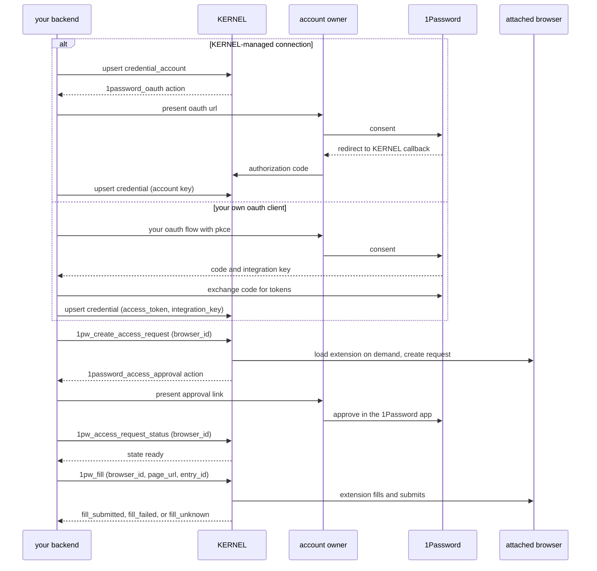

**status:** <Badge color="yellow">preview</Badge>

a vault-attached browser can get a login from two places. KERNEL can host a
collection form and store the values in a `credential` item, or a user can
approve access to logins that stay in their 1Password account.

## Choose a path

you or your agent must ask the end user whether they want to use 1Password for
the website's login. if they do, link their 1Password account and request the
login through [1Password brokered approval](#1password-brokered-approval). if
they don't, or if that path doesn't produce a usable login for any reason, fall
back to [KERNEL-hosted collection](#kernel-hosted-credential-collection). see
[fall back to KERNEL-hosted collection](#fall-back-to-kernel-hosted-collection)
for when to switch.

keep in mind the limits of 1Password's api when you ask: the login must be in a
private vault that isn't shared, and passkeys aren't supported. if the user's
login is in a shared vault or the user signs in with a passkey, fall back to
KERNEL-hosted collection.

| | KERNEL-hosted collection | 1Password brokered approval |
| --- | --- | --- |
| where values live | encrypted in a KERNEL `credential` item | in the user's 1Password account; KERNEL stores encrypted references in a `credential` item |
| items | one `credential` item with `provider: "kernel"` | a `credential` item with `provider: "1password"`, backed by a connected `credential_account` or by an access token and integration key you supply |
| human step | enter values in a KERNEL-hosted form | consent once when the account is linked, then approve each access request in the 1Password app |
| browser operation | [`fill`](/vaults/fill): your controller supplies field names and selectors | `1pw_fill`: the 1Password extension selects the fields; you supply the page url |
| submission | `fill` never submits the form | the extension fills and submits the form; if it can't submit, it clears what it filled |
| destination check | your controller authorizes the destination | the page must share the origin of an approved login |
| supported logins | any fields you define | logins with a username, password, and one-time password, stored in a private, non-shared vault; no passkeys |
| totp | KERNEL generates codes from a stored seed | 1Password fills the login's stored one-time password; when the site asks for it on a later page, invoke `1pw_fill` again there |
| availability | preview | preview |

neither path confirms that the website accepted the login. check the page after
filling.

## KERNEL-hosted credential collection

KERNEL-hosted collection works for any user and is the fallback when the
1Password path doesn't. create a `credential` item with `provider: "kernel"`,
present its `collect` action to the user, then invoke [`fill`](/vaults/fill).
see [credential items](/vaults/credentials) for the full flow.

## 1Password brokered approval

brokered approval uses 1Password's
[Agentic Autofill](https://www.1password.dev/agentic-autofill/partners). the user
reviews each access request in the 1Password app on their own device and chooses
which logins to grant. the 1Password browser extension, which KERNEL loads into
the vault-attached browser, then fills the granted login into the page. KERNEL
and your agent don't handle the login values. check 1Password's
[supported accounts, vaults, and apps](https://www.1password.dev/agentic-autofill/partners#supported-today)
before you plan a rollout.

### Choose an OAuth client

every 1Password connection belongs to an oauth client. 1Password shows the
client's name and icon on the consent screen and in the approval prompt, so the
choice decides what your users see and how much of the account linking flow
you need to build yourself.

| | KERNEL-managed oauth client | your own oauth client |
| --- | --- | --- |
| what your users see | KERNEL on the consent screen and approval prompt | your integration's name and icon |
| account linking | KERNEL runs the oauth flow, stores the connection, and refreshes its tokens | you register the client and run the whole flow, then give KERNEL the access token and integration key |
| KERNEL items | a `credential_account` for the connection, plus a `credential` per login request | a `credential` per login request, holding your token and key |
| token lifetime | KERNEL keeps the connection current | you refresh the access token and update the item before each task |

#### KERNEL-managed OAuth client

tell your users that KERNEL is the browser provider that fills their logins
through the 1Password extension, and that neither KERNEL nor your agent handles
the login values. then:

1. create a `credential_account` item to link the user's 1Password account. see [connect a 1Password account](#connect-a-1password-account).
2. create a `credential` item with `account` set to that item's key to describe the login you need. see [define a login request](#define-a-login-request).
3. in a vault-attached browser, invoke `1pw_create_access_request`, give the user the approval link, and poll `1pw_access_request_status`. see [request access and hand off approval](#request-access-and-hand-off-approval).
4. once the user approves, invoke `1pw_fill` on that item in a browser session. see [fill and submit](#fill-and-submit).

#### Your own OAuth client

you're responsible for the full account linking flow. follow 1Password's guides:

- register an oauth client with an https redirect uri. see [go to production](https://www.1password.dev/agentic-autofill/partners/production).
- run the authorization code flow with pkce (`S256`) and validate `state`. see [connect a user](https://www.1password.dev/agentic-autofill/partners/connect).
- capture the integration key from your callback's url fragment, exchange the code, and refresh the access token from your backend. see [store keys and tokens](https://www.1password.dev/agentic-autofill/partners/keys-and-tokens).
- revoke the connection when the user disconnects. see [disconnect a user](https://www.1password.dev/agentic-autofill/partners/disconnect).

then:

1. create a `credential` item with the user's `access_token` and `integration_key` to describe the login you need. see [use your own oauth client](#use-your-own-oauth-client).
2. before each task, refresh the access token on your backend and send it with `1pw_update_access_token`. see [replace a stored access token](#replace-a-stored-access-token).
3. in a vault-attached browser, invoke `1pw_create_access_request`, give the user the approval link, and poll `1pw_access_request_status`. see [request access and hand off approval](#request-access-and-hand-off-approval).
4. once the user approves, invoke `1pw_fill` on that item in a browser session. see [fill and submit](#fill-and-submit).

on either path, if a step doesn't produce a usable login,
[fall back to KERNEL-hosted collection](#fall-back-to-kernel-hosted-collection).

KERNEL never refreshes or revokes a token you supply. your refresh token and
client secret stay in your backend; KERNEL never needs them.


```mermaid
sequenceDiagram
  participant App as your backend
  participant K as KERNEL
  participant U as account owner
  participant OP as 1Password
  participant B as attached browser
  alt KERNEL-managed connection
    App->>K: upsert credential_account
    K-->>App: 1password_oauth action
    App->>U: present oauth url
    U->>OP: consent
    OP-->>U: redirect to KERNEL callback
    U->>K: authorization code
    App->>K: upsert credential (account key)
  else your own oauth client
    App->>U: your oauth flow with pkce
    U->>OP: consent
    OP-->>App: code and integration key
    App->>OP: exchange code for tokens
    App->>K: upsert credential (access_token, integration_key)
  end
  App->>K: 1pw_create_access_request (browser_id)
  K->>B: load extension on demand, create request
  K-->>App: 1password_access_approval action
  App->>U: present approval link
  U->>OP: approve in the 1Password app
  App->>K: 1pw_access_request_status (browser_id)
  K-->>App: state ready
  App->>K: 1pw_fill (browser_id, page_url, entry_id)
  K->>B: extension fills and submits
  K-->>App: fill_submitted, fill_failed, or fill_unknown
```

### Connect a 1Password account

create a `credential_account` item in the user's vault. it returns
`state.status: "pending_authorization"` and an `action` named
`1password_oauth`. present `action.url` to the signed-in user in your
application, outside the agent-controlled browser. the user signs in to
1Password and approves the connection. this path uses KERNEL's oauth client;
`credential_account` items don't accept a custom one. to use your own client,
skip the account and [supply your own tokens](#use-your-own-oauth-client).

<CodeGroup>

```typescript TypeScript
let account = await kernel.vaults.items.upsert("1password-account", {
  id_or_name: vault.id,
  type: "credential_account",
  spec: {
    provider: "1password",
    authorization: { method: "oauth", client: { type: "kernel_managed" } },
  },
});
if (account.type !== "credential_account") {
  throw new Error("unexpected item type");
}
if (account.action?.name === "1password_oauth") {
  // Present account.action.url to the signed-in user in your application.
}

account = await kernel.vaults.items.retrieve("1password-account", {
  id_or_name: vault.id,
  wait: 60,
});
if (account.type !== "credential_account" || account.state.status !== "connected") {
  throw new Error("1Password account isn't connected");
}
```

```python Python
account = kernel.vaults.items.upsert(
    "1password-account",
    id_or_name=vault.id,
    type="credential_account",
    spec={
        "provider": "1password",
        "authorization": {"method": "oauth", "client": {"type": "kernel_managed"}},
    },
)
if account.type != "credential_account":
    raise RuntimeError("unexpected item type")
if account.action is not None and account.action.name == "1password_oauth":
    pass  # Present account.action.url to the signed-in user in your application.

account = kernel.vaults.items.retrieve("1password-account", id_or_name=vault.id, wait=60)
if account.type != "credential_account" or account.state.status != "connected":
    raise RuntimeError("1Password account isn't connected")
```

</CodeGroup>

KERNEL receives the oauth callback, exchanges the code, stores the connection
encrypted, and refreshes its tokens. the api never returns tokens or other
connection secrets.

| `state.status` | meaning | next step |
| --- | --- | --- |
| `pending_authorization` | waiting for consent | present `action.url`; read with `wait` |
| `connected` | the connection is usable | define credential items |
| `declined` | the user declined consent | repeat the upsert to get a new authorization url, or use `1pw_recover` when it's advertised |
| `reconnect_required` | the connection needs reauthorization; `state.status_reason` explains why | repeat the upsert, or use `1pw_recover` when it's advertised |

the authorization url expires after a short time. repeating the same upsert
returns the current url while it's valid and issues a new one after it
expires. a `wait` read keeps holding while the status is
`reconnect_required`, so check the status instead of waiting for it to change.

#### Recover a failed account link

if linking the account fails in a way KERNEL can recover from, the
`credential_account` advertises `1pw_recover` and `state.status_reason`
describes the failure. invoke it to get a new `1password_oauth` action, and
present its `url` to the user as you did when connecting. after recovery
completes, start a new authorization on the same item by repeating the account
upsert. don't delete the account to recover, and don't retry recovery
automatically.

### Define a login request

create a `credential` item with `provider: "1password"` and `account` set to
the key of a connected `credential_account` in the same vault. the item stores
the account's key, not its id, and returns it in `spec.account`. `requests`
uses 1Password's version 2 credential request format with one to five `login`
entries, each with an https `website`. the item stores no values or selectors.

<CodeGroup>

```typescript TypeScript
const credential = await kernel.vaults.items.upsert("github-login", {
  id_or_name: vault.id,
  type: "credential",
  spec: {
    provider: "1password",
    account: "1password-account",
    requests: {
      version: 2,
      goal: "Review open pull requests",
      entries: [
        {
          type: "login",
          parameters: { website: "https://github.com" },
          reason: "Sign in to GitHub",
        },
      ],
    },
  },
});
```

```python Python
credential = kernel.vaults.items.upsert(
    "github-login",
    id_or_name=vault.id,
    type="credential",
    spec={
        "provider": "1password",
        "account": "1password-account",
        "requests": {
            "version": 2,
            "goal": "Review open pull requests",
            "entries": [
                {
                    "type": "login",
                    "parameters": {"website": "https://github.com"},
                    "reason": "Sign in to GitHub",
                }
            ],
        },
    },
)
```

</CodeGroup>

`goal` accepts up to 140 characters, each entry's `reason` up to 100, and an
entry can include one to five `keywords` of up to 50 characters each. the new
item starts in `pending_authorization` and advertises
`1pw_create_access_request`. the source, account, and requests are immutable;
repeating the same upsert returns the current item, and a different spec at
the same key returns `409`. use a new item key for different logins. the
deprecated `website` shorthand is still accepted for account-backed items, but
supply `requests` for new items.

#### Use your own OAuth client

instead of `account`, supply the user's `access_token` and the matching
`integration_key` that your oauth client received from 1Password. KERNEL checks
that they belong together, stores both encrypted on this item, and never
returns either. set `access_token_expires_at` from the token response's
`expires_in` so KERNEL knows when the token stops working; it must be in the
future, and the item returns it in `spec.access_token_expires_at`. these items
require `requests`.

<CodeGroup>

```typescript TypeScript
const credential = await kernel.vaults.items.upsert("github-login", {
  id_or_name: vault.id,
  type: "credential",
  spec: {
    provider: "1password",
    access_token: tokenResponse.access_token,
    integration_key: integrationKey,
    access_token_expires_at: new Date(Date.now() + tokenResponse.expires_in * 1000).toISOString(),
    requests: {
      version: 2,
      entries: [{ type: "login", parameters: { website: "https://github.com" } }],
    },
  },
});
```

```python Python
from datetime import datetime, timedelta, timezone

expires_at = datetime.now(timezone.utc) + timedelta(seconds=token_response["expires_in"])
credential = kernel.vaults.items.upsert(
    "github-login",
    id_or_name=vault.id,
    type="credential",
    spec={
        "provider": "1password",
        "access_token": token_response["access_token"],
        "integration_key": integration_key,
        "access_token_expires_at": expires_at.isoformat(),
        "requests": {
            "version": 2,
            "entries": [{"type": "login", "parameters": {"website": "https://github.com"}}],
        },
    },
)
```

</CodeGroup>

supply `account` or both secrets, never both; a mismatched or incomplete pair
returns `400`. repeating the create with identical values returns the current
item. a create at the same key with a different token, key, expiry, or
requests returns `409`, so don't use the upsert to rotate the token. after
`access_token_expires_at` passes, the item stops advertising
`1pw_create_access_request`, `1pw_access_request_status`, and `1pw_fill`, and
`1pw_fill` returns `409` until you replace the token. the token response and
integration key in these samples stand for values your backend already holds;
don't pass them through a model.

#### Replace a stored access token

1Password access tokens are short-lived, so refresh the token on your backend
as [1Password describes](https://www.1password.dev/agentic-autofill/partners/connect#refresh-the-access-token)
and invoke `1pw_update_access_token` with the new `access_token` before you
request access, poll, or fill. the new token must match the stored integration
key. the operation replaces only the token:
the integration key, requests, pending access request, approved references,
and `state.status` stay as they were. set `access_token_expires_at` to record
the new expiry, or omit it to clear the old one.

<CodeGroup>

```typescript TypeScript
await kernel.vaults.items.performOperation("github-login", {
  id_or_name: vault.id,
  type: "1pw_update_access_token",
  access_token: tokenResponse.access_token,
  access_token_expires_at: new Date(Date.now() + tokenResponse.expires_in * 1000).toISOString(),
});
```

```python Python
kernel.vaults.items.perform_operation(
    "github-login",
    id_or_name=vault.id,
    type="1pw_update_access_token",
    access_token=token_response["access_token"],
    access_token_expires_at=(
        datetime.now(timezone.utc) + timedelta(seconds=token_response["expires_in"])
    ).isoformat(),
)
```

</CodeGroup>

stored-token items advertise `1pw_update_access_token` whenever no other
1Password operation is in progress; during one, it returns `409`. updating the
token doesn't contact 1Password and doesn't retry a pending or uncertain
operation.

#### Request several logins

a `requests` object can hold up to five `login` entries, so one approval can
cover several logins. the user can approve some entries and not others. when
approved entries share an origin, pass `entry_id` to `1pw_fill` to choose one.
`reason` and `keywords` overrides at request time work only when the item has a
single entry.

<CodeGroup>

```typescript TypeScript
await kernel.vaults.items.upsert("example-portal-logins", {
  id_or_name: vault.id,
  type: "credential",
  spec: {
    provider: "1password",
    account: "1password-account",
    requests: {
      version: 2,
      goal: "Reconcile this month's invoices",
      entries: [
        {
          type: "login",
          parameters: { website: "https://portal.example.com/billing" },
          reason: "Download invoices",
        },
        {
          type: "login",
          parameters: { website: "https://portal.example.com/admin" },
          reason: "Update payment settings",
        },
      ],
    },
  },
});
```

```python Python
kernel.vaults.items.upsert(
    "example-portal-logins",
    id_or_name=vault.id,
    type="credential",
    spec={
        "provider": "1password",
        "account": "1password-account",
        "requests": {
            "version": 2,
            "goal": "Reconcile this month's invoices",
            "entries": [
                {
                    "type": "login",
                    "parameters": {"website": "https://portal.example.com/billing"},
                    "reason": "Download invoices",
                },
                {
                    "type": "login",
                    "parameters": {"website": "https://portal.example.com/admin"},
                    "reason": "Update payment settings",
                },
            ],
        },
    },
)
```

</CodeGroup>

### Request access and hand off approval

create a browser with the vault attached, then invoke
`1pw_create_access_request` with its `browser_id`. you don't install anything:
KERNEL loads the 1Password extension into that browser on demand the first time
an operation needs it, then creates the access request through the extension.
`goal`, `reason`, and `keywords` in the operation override the item's values
for this request.

<CodeGroup>

```typescript TypeScript
const browser = await kernel.browsers.create({ vaults: [{ id: vault.id }] });

const requested = await kernel.vaults.items.performOperation("github-login", {
  id_or_name: vault.id,
  type: "1pw_create_access_request",
  browser_id: browser.session_id,
});
if (requested.type !== "credential" || requested.action?.name !== "1password_access_approval") {
  throw new Error("1Password didn't return an approval link");
}
// Present requested.action.url to the account owner. Don't modify it.
```

```python Python
browser = kernel.browsers.create(vaults=[{"id": vault.id}])

requested = kernel.vaults.items.perform_operation(
    "github-login",
    id_or_name=vault.id,
    type="1pw_create_access_request",
    browser_id=browser.session_id,
)
if (requested.type != "credential" or requested.action is None or
        requested.action.name != "1password_access_approval"):
    raise RuntimeError("1Password didn't return an approval link")
# Present requested.action.url to the account owner. Don't modify it.
```

</CodeGroup>

the response returns an `action` named `1password_access_approval`. its `url`
is a native `onepassword://grant-brokered-access` link and `instructions`
describes the handoff. present the link to the end user who owns the 1Password
account. they open it on the device where they use the 1Password app, choose
the logins, and approve or deny there. the link grants nothing until they
approve. 1Password closes the approval prompt after a short time; if the user
doesn't finish, create a new `credential` item to send a new request. an item
accepts only one access request.

the approval link carries your goal, reasons, and websites. don't log it, don't
pass it through a model, and deliver it to the user's device over an
authenticated channel. see 1Password's
[approval guide](https://www.1password.dev/agentic-autofill/partners/approval#deliver-the-approval-link).

`state.access_request` reports non-secret request state, such as its `id`,
`state`, `entries`, `granted_count`, and whether a fillable reference exists
(`has_autofill_token`). other fields are echoed from 1Password's response when
it supplies them.

don't automatically retry a failed request. if the call fails before KERNEL
dispatches the request to 1Password, the item still advertises
`1pw_create_access_request`. if it fails after dispatch, the outcome is
uncertain: a request might exist in 1Password. the item stays blocked in
`pending_authorization` with no approval action and no available operations,
and KERNEL doesn't offer a way to retry or reset it. ask the account owner to
check the 1Password app for a pending request instead of sending another.

### Poll for the decision

after you present the approval link, invoke `1pw_access_request_status` with a
vault-attached `browser_id` until the status leaves `pending_authorization`.
`timeout_seconds` accepts 0–120 and defaults to 10. KERNEL records the decision
only when you poll; a `wait` read of the item doesn't observe approval.

<CodeGroup>

```typescript TypeScript
let item: Kernel.Vaults.VaultItemOperationResponse = requested;
while (item.type === "credential" && item.state.status === "pending_authorization") {
  item = await kernel.vaults.items.performOperation("github-login", {
    id_or_name: vault.id,
    type: "1pw_access_request_status",
    browser_id: browser.session_id,
    timeout_seconds: 60,
  });
}
if (item.type !== "credential" || item.state.status !== "ready") {
  throw new Error("1Password access wasn't granted");
}
```

```python Python
item = requested
while item.type == "credential" and item.state.status == "pending_authorization":
    item = kernel.vaults.items.perform_operation(
        "github-login",
        id_or_name=vault.id,
        type="1pw_access_request_status",
        browser_id=browser.session_id,
        timeout_seconds=60,
    )
if item.type != "credential" or item.state.status != "ready":
    raise RuntimeError("1Password access wasn't granted")
```

</CodeGroup>

| request state | item `state.status` | result |
| --- | --- | --- |
| `pending` | `pending_authorization` | the approval action remains; poll again |
| `resolved` | `ready` | the approval action is removed and `1pw_fill` is advertised |
| `denied` | `declined` | no reference is kept |
| `failed` | `failed` | no reference is kept |

`declined` and `failed` are final for the item; use a new key to request
again. an item with several entries also moves to `failed` if 1Password
doesn't report which approved login belongs to which website;
`state.status_reason` then recommends separate credential items. if
1Password resolves a single-entry request without exactly one matching login,
polling returns `409`; inspect the request in 1Password before polling again.
approved references stay encrypted and are only usable by `1pw_fill`. `ready`
means an approval was recorded, not that 1Password will honor it
indefinitely.

### Fill and submit

navigate the attached browser to the page with the username and password form,
not a page that asks the user to choose a sign-in method. then invoke `1pw_fill` with
the browser's session id and the exact current top-level `page_url`. the url
must match exactly one open page and share the origin of an approved entry.
when more than one approved entry has that origin, pass its `entry_id` from
`state.access_request.entries`. the extension selects the fields, fills them,
and submits the form; you can't supply selectors or values. on
`fill_submitted`, the filled values have left the page. if the extension fills
the form but can't submit it, it clears what it filled and KERNEL returns
`fill_failed`. a submitted form doesn't mean the login succeeded.

for a sign-in that spans several pages, such as a username page, a password
page, and a one-time password page, invoke `1pw_fill` again on each page. each
page must share the origin of the approved entry, and every fill is a new
request to 1Password, so an ended grant fails at the next fill.

<Note>
  KERNEL locks the browser while `1pw_fill` runs. inbound control surfaces for
  that browser, such as CDP connections and browser API calls, are blocked
  until the call returns.
</Note>

<CodeGroup>

```typescript TypeScript
const approved = await kernel.vaults.items.retrieve("example-portal-logins", {
  id_or_name: vault.id,
});
if (approved.type !== "credential" || approved.state.provider !== "1password") {
  throw new Error("unexpected item");
}
const billing = approved.state.access_request?.entries?.find(
  (entry) => entry.parameters?.website === "https://portal.example.com/billing",
);
if (!billing?.id) throw new Error("the billing login wasn't requested");

const result = await kernel.vaults.items.performOperation("example-portal-logins", {
  id_or_name: vault.id,
  type: "1pw_fill",
  browser_id: browser.session_id,
  page_url: "https://portal.example.com/login",
  entry_id: billing.id,
});
if (result.type !== "1pw_fill") throw new Error("unexpected operation response");
if (result.status === "fill_failed") {
  console.log(result.error_code);
}
```

```python Python
approved = kernel.vaults.items.retrieve("example-portal-logins", id_or_name=vault.id)
if approved.type != "credential" or approved.state.provider != "1password":
    raise RuntimeError("unexpected item")
entries = approved.state.access_request.entries if approved.state.access_request else None
billing = next(
    (e for e in entries or [] if e.parameters and e.parameters.website == "https://portal.example.com/billing"),
    None,
)
if billing is None or billing.id is None:
    raise RuntimeError("the billing login wasn't requested")

result = kernel.vaults.items.perform_operation(
    "example-portal-logins",
    id_or_name=vault.id,
    type="1pw_fill",
    browser_id=browser.session_id,
    page_url="https://portal.example.com/login",
    entry_id=billing.id,
)
if result.type != "1pw_fill":
    raise RuntimeError("unexpected operation response")
if result.status == "fill_failed":
    print(result.error_code)
```

</CodeGroup>

for an item with one entry, omit `entry_id`. `timeout_ms` accepts 1–30,000 and
defaults to 30,000.

| outcome | meaning | next step |
| --- | --- | --- |
| `200` `fill_submitted` | the extension filled and submitted the form | check the page; website authentication isn't verified |
| `200` `fill_failed` | the extension reported `fillFailed`, `autosubmitFailed`, `noExistingCredentials`, or `authenticationFailed` | inspect the page before trying again |
| `200` `fill_unknown` | the fill was dispatched but the outcome is inconclusive; it might have submitted | check the page; don't retry in the same browser |
| `400` `page_not_found` or `ambiguous_page` | `page_url` matched no page or more than one | fix the url or close duplicate tabs |
| `400` `invalid_request` | the fill request was rejected as invalid | check `browser_id`, `page_url`, and `timeout_ms` before trying again |
| `403` `destination_denied` | the page is outside every approved login origin | navigate to a requested website |
| `409` | the item isn't `ready`, its approval is unusable, `entry_id` is missing or doesn't match an approved entry for the page, or a stored access token has expired | retrieve the item and follow `available_operations` |

### Fall back to KERNEL-hosted collection

when the 1Password path can't give you a usable login, create a separate
`credential` item with `provider: "kernel"` and
[collect the login](#kernel-hosted-credential-collection) from the user
instead. switch when:

- the user doesn't want to use 1Password, the login is in a shared vault or is a passkey, or their account isn't in 1Password's [supported list](https://www.1password.dev/agentic-autofill/partners#supported-today).
- account linking doesn't reach `connected`, for example because the user declined consent.
- the access request ends `declined` or `failed`, or the user doesn't approve it before the prompt closes.
- `1pw_fill` keeps returning `fill_failed` on the website's login form.
- a stored access token can't be refreshed, and the user doesn't want to connect 1Password again.

after `fill_unknown`, check the page before you fall back; the extension might
already have submitted the form. tell the user why you're asking for the login
again.

### Delete items

delete a 1Password `credential` item to discard its approval references and,
for a stored-token item, its encrypted token and key. delete every
`credential` item that references an account before deleting the
`credential_account`; otherwise the api returns `409`. deleting the account
removes KERNEL's stored connection. deleting either item doesn't remove the
connection or revoke the token in the user's 1Password account. if you use your
own oauth client, revoke the connection from your backend when the user
disconnects; see 1Password's
[disconnect guide](https://www.1password.dev/agentic-autofill/partners/disconnect).

## Limitations

- **not secret isolation:** for each access request, status check, and fill, KERNEL gives the extension inside the attached browser access to the connected account or supplied token, and it doesn't remove the extension afterward. use a dedicated browser for 1Password operations, don't give untrusted automation access to it, and don't load extensions you don't trust alongside it. the filled values are in the page between fill and submit.
- **private vaults only, no passkeys:** 1Password's api can grant only logins stored in the user's private, non-shared vault, and it doesn't support passkeys. see 1Password's [supported list](https://www.1password.dev/agentic-autofill/partners#supported-today).
- **up to five logins per item:** each `credential` item carries one to five https login entries.
- **you manage your own oauth client's tokens:** KERNEL doesn't refresh or revoke a supplied access token. refresh it on your backend and replace it with `1pw_update_access_token` before each task.
- **submission isn't authentication:** `fill_submitted` means the form was submitted, not that the login succeeded. confirm the result on the page.
- **no automatic retries:** access requests, recovery, and inconclusive fills can have effects in 1Password or on the website. an access request with an uncertain outcome stays blocked; don't send another automatically.

## Related

- [vaults overview](/vaults/overview): resource model, scope, and browser attachment.
- [credential items](/vaults/credentials): KERNEL-hosted collection.
- [fill browser fields](/vaults/fill): selector-based fill for KERNEL credentials.
- [1Password for managed auth](/integrations/1password): a separate integration that reads 1Password items with a service account during managed auth logins.
