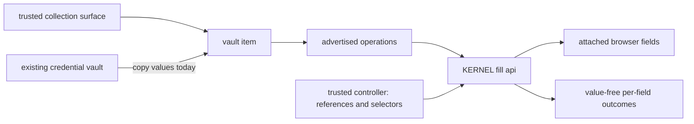

**status:** <Badge color="yellow">preview</Badge>

<span className="kernel-brand-name">KERNEL</span> vaults group typed items that
an attached browser can use. add a `credential` item for login or other
non-payment credentials, or use provider-backed `wallet` and `card` items for
payments. sensitive values aren't returned by the vault api.

use KERNEL's [`fill` api](/vaults/fill) to safely inject stored values from supported items into browser fields without passing the values through your application's injection code or model context. your controller supplies references and selectors; KERNEL writes the values and returns outcomes, not the values. invoke `fill` when the item advertises it in `available_operations`.

for authentication workflows where your application or agent controls
navigation and submission, start with [Fill from Vault](/auth/fill-from-vault).

<Warning>
  fill isn't secret isolation from the browser. an agent with unrestricted
  browser access, page scripts, or extensions can read values after filling.
</Warning>

<Note>
  vaults are in preview. supported item types are `credential`, `wallet`, and
  `card`. available operations depend on the item type and current state.
  credential items currently don't use a provider or wallet. for payment items,
  see [wallet integrations](/integrations/wallets/overview).
</Note>

## How vaults work

### Sensitive values do not come back through the api

sensitive values do not have a read path through the vault api. item responses
return definitions, safe state, actions, and events. payment items can also
return masks and/or aliases. credential fields marked `sensitive: false` return
their populated values in `state.fields`. leave fields sensitive when they must
remain write-only; set `sensitive: false` only when your backend or collection
form needs to read and prefill an ordinary username or email address.

### Use credentials from your existing vault

you can keep your existing vault as the source of truth. today, your trusted
backend reads the values from that vault and [copies them into a KERNEL credential
item](/vaults/existing-credential-vault). KERNEL encrypts and stores that copy.
the credential item becomes ready, and `fill` can write its fields into an
attached browser without including their values in the fill request.

the copy isn't a live connection to your existing vault. when a credential
changes there, update the KERNEL item before its next use. delete the item when
your retention policy no longer permits KERNEL to hold the copy.

in the future, a credential item might instead be backed by a third-party vault
connection. that would follow the same resource pattern as a card item backed by
a third-party wallet connection: the item remains the interface used by browser
operations while the connection supplies the underlying material. third-party
credential backing isn't currently available.

| item backing | material path | availability |
| --- | --- | --- |
| KERNEL-backed credential | your trusted backend copies values from your source vault into the item | available today |
| third-party-backed credential | a provider connection supplies values to the item | possible future model; not available today |
| provider-backed card | a supported wallet provider supplies payment material to the item | available today |

<a id="fill-or-use-payment-aliases" />

### Inject values with KERNEL's fill api

retrieve the item and require `fill` in `available_operations`. your controller authorizes the destination and supplies field names and selectors, not the stored values. KERNEL checks the browser attachment and item lifecycle, validates the target inputs, and writes values into the attached browser.

`fill` returns value-free per-field outcomes. it doesn't submit a form or establish the site's acceptance. inspect failed or unknown outcomes before taking another action; don't automatically retry. see [fill browser fields](/vaults/fill) for the request and outcome contract.

some integrations use a different operation or handoff. [agentcard](/integrations/wallets/agentcard) uses aliases and provider-executed checkout instead of `fill`; this is not a requirement for other vault items.

### Vaults attach to browser sessions

attach one or more vaults when you create a browser. the binding cannot change
for the life of the session and is enforced outside the browser vm. the binding
is required for browser operations, including `fill`.

## Resource model

| resource           | technical behavior                                                                                  |
| ------------------ | --------------------------------------------------------------------------------------------------- |
| vault              | resource with an immutable `name` that groups typed items                                 |
| item               | typed resource addressed by an immutable `key`: `credential`, `wallet`, or `card` |
| alias              | non-sensitive, format-valid stand-in returned in state for eligible items; aliases belong to that item |
| action             | user interaction returned as `action`, such as a hosted collection or approval url                  |
| operation          | api action advertised in `available_operations`: `collect`, `authorize`, `prepare_checkout`, or `fill`, when eligible |
| expansion          | live provider data advertised in `available_expansions`; the initial expansion is `payment_methods` |
| event              | immutable item observation with `id`, `name`, optional `browser_id`, `data`, and `created_at`       |
| browser attachment | vault reference fixed when the browser is created                                                   |



## Scope and attachment

select project scope on the sdk client or use a project-scoped api key. for direct api requests, `X-Kernel-Project` accepts a project id or name. `project_id` is not accepted in a vault request body. without explicit project scope, <span className="kernel-brand-name">KERNEL</span> uses the organization's default project.

attach vaults when you create a browser:

<CodeGroup>

```typescript TypeScript
const browser = await kernel.browsers.create({
  vaults: [{ id: vault.id }],
});
```

```python Python
browser = kernel.browsers.create(
    vaults=[{"id": vault.id}],
)
```

```bash CLI
kernel browsers create --vault user-12345 -o json
```

</CodeGroup>

the `vaults` array supports up to 20 references. each reference accepts exactly one of `id` or `name`, and attachments cannot change after browser creation. a browser and vault must belong to the same project.

attachment grants the browser access to the vault, not to a selected set of items. items created later in the same vault are available to every attached browser in that project. use separate vaults when browser tasks must not share access. deleting a vault or item prevents further use through that resource. it doesn't undo values already filled into a browser or actions already performed by a site.

## Api behavior

create or retrieve a vault by its immutable `name`. names accept 1–255 letters, numbers, `.`, `_`, and `-`, but can't use a cuid-like value that could be mistaken for a vault id. vault responses contain `id`, `name`, `created_at`, and `updated_at`.

```bash CLI
kernel vaults create --name user-12345
kernel vaults get user-12345 -o json
kernel vaults items list user-12345 -o json
```

item keys are immutable and accept 1–255 letters, numbers, `.`, `_`, and `-`. creating an item at an existing key succeeds only when its type, specification, and provider, where applicable, match the existing item and its lifecycle permits retrieval. otherwise, the api returns a conflict.

retrieve an item before acting on it. responses expose these fields and advertise what the current state permits:

| field                                    | behavior                                             |
| ---------------------------------------- | ---------------------------------------------------- |
| `id`, `key`, `type`                      | stable item identity; `key` and `type` cannot change |
| `spec`                                   | type-specific definition saved with the item          |
| `state`                                  | type-specific status and safe output       |
| `version`                                | credential item revision used for updates and observing edits |
| `action`                                 | current user action, when one is required            |
| `available_operations`                   | operations valid in the current state                |
| `available_expansions`                   | live provider data the item can request              |
| `expanded`                               | requested live data; not persisted on the item       |
| `expires_at`, `created_at`, `updated_at` | item timestamps when present                         |

when `action` is present, complete it in a trusted user-facing surface. treat an
action url as a short-lived bearer link: bind it to the authenticated user,
vault, and item, and don't log it. in application integrations, present the link
directly to the user rather than putting it in model context. invoke only
operations listed in `available_operations`, and request only expansions listed
in `available_expansions`. don't hard-code provider transitions from a previous
response.

item reads accept `wait` values from 0–60 seconds. payment reads return early when the item no longer has an unresolved authorization or approval transition. credential reads wait for readiness, not edits to an already-ready item; observe its `version` to detect changes. event reads support the same maximum wait and return an ordered array. use the last event `id` as the `after` cursor for newer events.

deleting a vault invalidates every item and alias it contains.

see the [vaults api reference](https://kernel.sh/docs/api-reference/vaults/create-or-retrieve-a-vault-by-immutable-name) for endpoints and complete request and response schemas.

## Payment items

payment items use the same vault resource model: a `wallet` connects a payment method through a provider, and a `card` represents payment material and authorization state. KERNEL's `fill` api injects values from supported cards without returning them to your application or model. agentcard uses an alias-based alternative.

see [payments on KERNEL](/browsers/payments) for the offering and lifecycle, then [choose a wallet integration](/integrations/wallets/overview).

<a id="agentcard-alias-handoff-happens-at-egress" />

for alias-based checkout, see [agentcard's lifecycle](/integrations/wallets/agentcard#lifecycle).

<a id="provider-configurations" />

for organization-scoped oauth client configuration, see [wallet provider configurations](/integrations/wallets/overview#provider-configurations).

<a id="payment-item-specifications" />
<a id="wallets" />
<a id="cards" />

for wallet and card specifications, see the [link](/integrations/wallets/stripe-link#item-reference) and [agentcard](/integrations/wallets/agentcard#item-reference) references.

<a id="payment-actions-states-and-aliases" />

for actions and unresolved provider outcomes, see [payment recovery](/integrations/wallets/overview#payment-actions-and-recovery).

## Next steps

- [credential items](/vaults/credentials): define fields, collect values, and update them safely.
- [use an existing credential vault](/vaults/existing-credential-vault): copy credentials from another vault and synchronize their lifecycle.
- [fill browser fields](/vaults/fill): safely inject stored values into browser fields without passing them through your application or model.
- [human-in-the-loop credential collection and form filling](/browsers/use-vault-credentials-in-browser-agent): try a cli prompt, then follow the sdk and cli walkthrough.
- [payments](/browsers/payments): connect wallets and let browser agents complete purchases.
