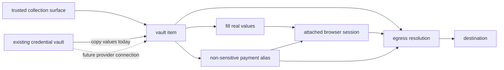

**status:** <Badge color="yellow">preview</Badge>

<span className="kernel-brand-name">KERNEL</span> vaults group typed items that
an attached browser can use. add a `credential` item for login or other
non-payment credentials, or use provider-backed `wallet` and `card` items for
payments. sensitive values aren't returned by the vault api.

there are two browser handoff paths. [fill](/vaults/fill) writes real values into
selected browser inputs and returns value-free outcomes. payment aliases are
non-sensitive stand-ins that KERNEL resolves at egress, outside the browser.
choose the path deliberately: their exposure boundaries differ.

for authentication workflows where your application or agent controls
navigation and submission, start with [Fill from Vault](/auth/fill-from-vault).

<Warning>
  fill isn't secret isolation from the browser. an agent with unrestricted
  browser access, page scripts, or extensions can read values after filling.
  only the alias-based payment path keeps the underlying values outside the browser.
</Warning>

<Note>
  vaults are in preview. supported item types are `credential`, `wallet`, and
  `card`. wallet and card providers are [link by stripe](/integrations/payments/stripe-link)
  and [agentcard](/integrations/payments/agentcard), not merchant payment processors.
  credential items currently don't use a provider or wallet.
</Note>

## How vaults work

### Sensitive values do not come back through the api

sensitive values do not have a read path through the vault api. item responses
return definitions, safe state, actions, and events. payment items can also
return masks and aliases. credential fields marked `sensitive: false` return
their populated values in `state.fields`. leave fields sensitive when they must
remain write-only; set `sensitive: false` only when your backend or collection
form needs to read and prefill an ordinary username or email address.

for link, KERNEL stores oauth credentials and approved one-use card
data with kms-backed envelope encryption. for agentcard, the underlying card
remains with agentcard. both providers connect the user's payment method through
a hosted flow, without passing card data through your application or agent.

### Use credentials from your existing vault

you can keep your existing vault as the source of truth. today, your trusted
backend reads the values from that vault and [copies them into a KERNEL credential
item](/vaults/existing-credential-vault). KERNEL encrypts and stores that copy.
the credential item becomes ready, and `fill` can write its fields into an
attached browser without including their values in the fill request.

the copy isn't a live connection to your existing vault. when a credential
changes there, update the KERNEL item before its next use. delete the item when
your retention policy no longer permits KERNEL to hold the copy.

in the future, a credential item might instead be backed by a third-party vault
connection. that would follow the same resource pattern as a card item backed by
a third-party wallet connection: the item remains the interface used by browser
operations while the connection supplies the underlying material. third-party
credential backing isn't currently available.

| item backing | material path | availability |
| --- | --- | --- |
| KERNEL-backed credential | your trusted backend copies values from your source vault into the item | available today |
| third-party-backed credential | a provider connection supplies values to the item | possible future model; not available today |
| provider-backed card | a supported wallet provider supplies payment material to the item | available today |

### Fill or use payment aliases

ready credential items can advertise `fill`. your
controller supplies field names and selectors; KERNEL writes the values into
the attached browser. fill doesn't submit a form or confirm the site's acceptance.

payment card items can also publish non-sensitive, format-valid aliases: a
luhn-valid 16-digit number, a three-digit cvc, and an expiry month and year.
these pass client-side checkout validation but can't resolve unless the browser
session and vault are bound together. credential items don't publish aliases.

### Vaults attach to browser sessions

attach one or more vaults when you create a browser. the binding cannot change
for the life of the session and is enforced outside the browser vm. the binding
is required for both fill and alias resolution.

### Alias substitution happens at egress

the <span className="kernel-brand-name">KERNEL</span> egress layer runs outside
the browser vm. when it recognizes a request containing an alias, it verifies
the browser, session, project, vault, item, and provider state before resolving
the provider-backed value. the browser receives the destination's response
without receiving that value. resolution fails closed when any binding or state
check does not match.

## Resource model

| resource           | technical behavior                                                                                  |
| ------------------ | --------------------------------------------------------------------------------------------------- |
| vault              | resource with an immutable `name` that groups typed items                                 |
| item               | typed resource addressed by an immutable `key`: `credential`, `wallet`, or `card` |
| alias              | non-sensitive, format-valid stand-in returned in item state; aliases belong to an item              |
| action             | user interaction returned as `action`, such as a hosted collection or approval url                  |
| operation          | api action advertised in `available_operations`: `collect`, `authorize`, `prepare_checkout`, or `fill`, when eligible |
| expansion          | live provider data advertised in `available_expansions`; the initial expansion is `payment_methods` |
| event              | immutable item observation with `id`, `name`, optional `browser_id`, `data`, and `created_at`       |
| browser attachment | vault reference fixed when the browser is created                                                   |



## Scope and attachment

select project scope on the sdk client or use a project-scoped api key. for direct api requests, `X-Kernel-Project` accepts a project id or name. `project_id` is not accepted in a vault request body. without explicit project scope, <span className="kernel-brand-name">KERNEL</span> uses the organization's default project.

attach vaults when you create a browser:

<CodeGroup>

```typescript TypeScript
const browser = await kernel.browsers.create({
  vaults: [{ id: vault.id }],
});
```

```python Python
browser = kernel.browsers.create(
    vaults=[{"id": vault.id}],
)
```

```bash CLI
kernel browsers create --vault user-12345 -o json
```

</CodeGroup>

the `vaults` array supports up to 20 references. each reference accepts exactly one of `id` or `name`, and attachments cannot change after browser creation. a browser and vault must belong to the same project.

attachment grants the browser access to the vault, not to a selected set of items. items created later in the same vault are available to every attached browser in that project. use separate vaults when browser tasks must not share access. deleting a vault or item prevents further use through that resource. it doesn't undo values already filled into a browser or actions already performed by a site.

## Api behavior

create or retrieve a vault by its immutable `name`. names accept 1–255 letters, numbers, `.`, `_`, and `-`, but can't use a cuid-like value that could be mistaken for a vault id. vault responses contain `id`, `name`, `created_at`, and `updated_at`.

```bash CLI
kernel vaults create --name user-12345
kernel vaults get user-12345 -o json
kernel vaults items list user-12345 -o json
```

item keys are immutable and accept 1–255 letters, numbers, `.`, `_`, and `-`. creating an item at an existing key succeeds only when its type, specification, and provider, where applicable, match the existing item and its lifecycle permits retrieval. otherwise, the api returns a conflict.

retrieve an item before acting on it. responses expose these fields and advertise what the current state permits:

| field                                    | behavior                                             |
| ---------------------------------------- | ---------------------------------------------------- |
| `id`, `key`, `type`                      | stable item identity; `key` and `type` cannot change |
| `spec`                                   | type-specific definition saved with the item          |
| `state`                                  | type-specific status and safe output       |
| `version`                                | credential item revision used for updates and observing edits |
| `action`                                 | current user action, when one is required            |
| `available_operations`                   | operations valid in the current state                |
| `available_expansions`                   | live provider data the item can request              |
| `expanded`                               | requested live data; not persisted on the item       |
| `expires_at`, `created_at`, `updated_at` | item timestamps when present                         |

when `action` is present, complete it in a trusted user-facing surface. treat an
action url as a short-lived bearer link: bind it to the authenticated user,
vault, and item, and don't log it. in application integrations, present the link
directly to the user rather than putting it in model context. invoke only
operations listed in `available_operations`, and request only expansions listed
in `available_expansions`. don't hard-code provider transitions from a previous
response.

item reads accept `wait` values from 0–60 seconds. payment reads return early when the item no longer has an unresolved authorization or approval transition. credential reads wait for readiness, not edits to an already-ready item; observe its `version` to detect changes. event reads support the same maximum wait and return an ordered array. use the last event `id` as the `after` cursor for newer events.

deleting a vault invalidates every item and alias it contains.

see the [vaults api reference](https://kernel.sh/docs/api-reference/vaults/create-or-retrieve-a-vault-by-immutable-name) for endpoints and complete request and response schemas.

## Payment items

the payment lifecycle below describes aliases.

a wallet
connects an end user's payment method through a provider-hosted flow. a card item
then publishes aliases that an attached browser can enter into a web checkout.
authorization and payment handoff happen outside the browser vm.

link and agentcard are credential providers, not merchant payment
processors. at the browser form layer, both work with any web checkout that
accepts standard card details, and the merchant's processor doesn't need to be
stripe. end-to-end handoff requires the outgoing request to match a native
processor adapter. the current adapters cover request formats used by stripe,
shopify, square, recurly, and razorpay; see [checkout and processor
coverage](/integrations/payments/overview#checkout-and-processor-coverage).

link creates a one-use card for an approved purchase. agentcard keeps a
reusable card item and requests approval for each checkout. wallet connection,
authorization, provider handoff, and checkout observations are recorded as
immutable events without card data.

read the [payments overview](/integrations/payments/overview) for the shared
lifecycle or use the [link by stripe](/integrations/payments/stripe-link) and
[agentcard](/integrations/payments/agentcard) provider guides.

## provider configurations

use KERNEL-managed credentials by default. if you need your own client, follow
the optional setup in [link](/integrations/payments/stripe-link#bring-your-own-link-oauth-client)
or [agentcard](/integrations/payments/agentcard#bring-your-own-agentcard-oauth-client). a named
provider configuration stores your application's `client_id` and `client_secret`,
not an end user's wallet grant. credentials are encrypted at rest; secrets are
never returned.

configurations are organization-scoped and shared across projects, unlike
project-scoped vaults. create, update, and delete require organization-scoped
authentication; project-scoped api keys receive `403`. names are unique within
the organization, and duplicate creates return `409` without replacing secrets.

- **selection:** choose exactly one config `id` or `name` when creating a wallet. the cli accepts `--provider-config-id` or `--provider-config-name`; responses resolve names to ids.
- **binding:** the wallet's configuration is immutable, and cards inherit it. renaming a config preserves bindings.
- **rotation:** updating `client_secret` affects all bound wallets. provider, client id, and agentcard mode cannot change; changing clients requires a new config and new wallets.
- **deletion:** returns `409` while any non-deleted item references the config, even if disconnected. it does not delete the external oauth client or revoke unrelated grants.

## Payment item specifications

wallet and card items accept these `spec` fields. fields not listed here are rejected. for the separate credential field schema, see [credential items](/vaults/credentials).

### Wallets

| provider  | required fields                                                                                    | optional fields                                                            |
| --------- | -------------------------------------------------------------------------------------------------- | -------------------------------------------------------------------------- |
| link      | `provider: 'link'`, `authorization.method: 'oauth'`, `authorization.client` | write-only `authorization.tokens` is required only with a customer-managed client |
| agentcard | `provider: 'agentcard'` | `provider_config`; `user_id` for a user already enrolled in the organization under the same configuration |

the default link client is `{type: 'kernel_managed'}`. for your own client, set
`authorization.client` to `{type: 'customer_managed', provider_config: {name: 'checkout-link'}}`
and supply `authorization.tokens` with `access_token` and `refresh_token`.

for payment settings ui, enforce at most one wallet per provider in each vault.
the api currently enforces uniqueness by item key, not by wallet provider, so a
different key can create a second wallet for the same provider. list items before
rendering provider options, hide the add option whenever that provider already
has a wallet in any state, and reuse or recover the existing item.

### Cards

| provider  | required fields                                                                                             | optional fields                                  |
| --------- | ----------------------------------------------------------------------------------------------------------- | ------------------------------------------------ |
| link      | `provider`, `wallet`, `payment_method_id`, `amount`, `currency`, `merchant_name`, `merchant_url`, `context` | `line_items`, `totals`, `metadata`, `expires_at` |
| agentcard | `provider`, `wallet`, `merchant`, `amount`, `currency`                                                      | `card_id`                                        |

a card's `spec.wallet` must reference a wallet in the same vault and from the
same provider.

`amount` uses minor currency units. link accepts 1–500000, requires a three-letter `currency`, limits `merchant_name` to 255 characters, requires an absolute http or https `merchant_url`, and requires at least 100 characters in `context`. its optional `expires_at` is a unix timestamp in seconds.

agentcard accepts amounts from 1–9007199254740991 and a three-letter `currency`. `merchant` accepts 1–120 printable characters without control characters. `card_id` uses the provider's `vc_` identifier, and wallet `user_id` uses its `usr_` identifier.

link `line_items` support `name`, `quantity`, `unit_amount`, `description`, `sku`, `url`, `image_url`, `product_url`, and `totals`. each `totals` entry supports `type`, `display_text`, and `amount`. link `metadata` accepts string values.

card updates replace the complete `spec`; they are not partial merges. link card items can update only while `requested`. agentcard card items can update while `requested` or `ready`, but not while approval is pending.

deleting a card consumes its aliases and clears any stored provider value.
deleting a wallet also invalidates its dependent cards.

## Payment actions, states, and aliases

`action.name` can be `link_oauth`, `spend_approval`, `push_approval`, `collect`, `mfa`, `embedded_ceremony`, or `card_enrollment`. actions that require a hosted interaction include a `url`. don't send action urls or provider authorization material to the agent.

wallet status values are:

- link: `pending_authorization`, `connected`, `declined`, `reconnect_required`, `degraded`
- agentcard: `pending_authorization`, `connected`, `degraded`

card status values are:

- link: `requested`, `pending_authorization`, `ready`, `consumed`, `expired`, `declined`, `recovery_required`
- agentcard: `requested`, `ready`, `pending_approval`, `degraded`, `recovery_required`

`recovery_required` means a card's provider outcome is unresolved. it stops
item wait loops and blocks new authorization, checkout, and deletion of the
card or its parent wallet or vault. inspect existing evidence and contact the
provider or support when manual reconciliation is needed. there is no reset
operation; deletion is not payment recovery.

card state can include `masks.brand`, `masks.last4`, and read-only aliases: `number`, `cvc`, `exp_month`, and `exp_year`. aliases are non-sensitive stand-ins, not standalone credentials or permission to use the provider-backed value.

## Next steps

- [credential items](/vaults/credentials): define fields, collect values, and update them safely.
- [use an existing credential vault](/vaults/existing-credential-vault): copy credentials from another vault and synchronize their lifecycle.
- [fill browser fields](/vaults/fill): map credential fields to browser inputs and handle outcomes.
- [human-in-the-loop credential collection and form filling](/browsers/use-vault-credentials-in-browser-agent): try a cli prompt, then follow the sdk and cli walkthrough.
- [enable payments in a browser agent](/browsers/enable-payments-in-browser-agent): connect a wallet and complete an alias-based checkout.
