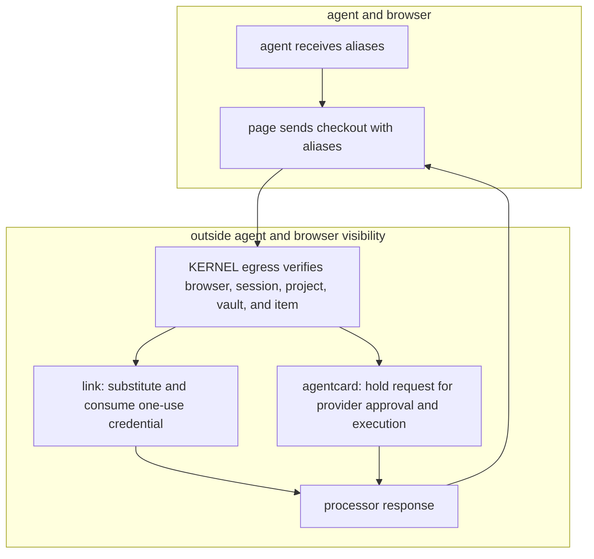

KERNEL vaults let your agent fill a checkout form without handling the underlying payment credential. your agent receives non-secret aliases. KERNEL coordinates the sensitive payment step at browser egress, outside the browser itself.

ordinary web checkouts remain necessary when a merchant doesn't offer an agent-facing payment interface. vaults preserve that form-filling workflow: the agent finds the payment fields and enters aliases, while KERNEL and the connected provider handle credential use.

<Note>
  vault apis prepare, scope, and observe payment credentials. they don't navigate to the merchant, click **pay**, or submit checkout. your browser automation still performs those actions.
</Note>

start with the [payment walkthrough](/vaults/payments) to connect a wallet, prepare a card item, attach its vault to a browser, and inspect the outcome.

## link: one-use credential substitution

a user connects a link wallet through the returned `link_oauth` action. you select a payment method from that wallet and create a card request with the merchant, amount, currency, purchase context, and explicit test or live intent.

authorization is a separate operation. retrieve the item, read its `available_operations`, and invoke `authorize` only when advertised and after explicit user approval. follow any returned approval action. once approved, KERNEL stores the one-use credential encrypted and returns aliases in `state.aliases`.

when the browser sends those aliases in a supported checkout request, KERNEL verifies the binding, substitutes the credential at egress, and consumes the item and aliases. the encrypted card value is cleared. this happens before the processor's outcome is known: `consumed` does **not** mean the purchase succeeded.

## agentcard: authorized request handoff

a user enrolls a reusable card through agentcard's hosted `card_enrollment` action. the underlying card stays with the provider's cardholder flow; KERNEL doesn't store its card number or cvc. your card item references the wallet and specifies a merchant, amount, and currency. you can pin a returned `card_id` or let the cardholder select a card during approval.

an agentcard card becomes `ready` when its wallet is connected. it does **not** advertise an `authorize` operation. instead, a supported outgoing checkout request triggers authorization: KERNEL holds the request, verifies the binding, and asks agentcard to authorize and execute it. the item exposes the approval action while the request is held.

KERNEL replays the approved processor response to the waiting browser. declines, expirations, and provider failures can produce a stripe-shaped error. the card item and aliases remain reusable after an authorization settles, including after a decline. `ready` describes the item's availability, not the previous payment's success. a second simultaneous checkout on the same item is rejected while approval is pending.

## the security boundary

the underlying payment credential is not placed in the page, agent context, screenshots, or browser replay. the browser sees aliases and the processor-shaped response, not the credential used to make the request.

aliases are **non-secret, format-valid checkout placeholders**: a luhn-valid card number, cvc, expiry month, and expiry year. use the returned values together. they are not standalone payment credentials or permission to spend. authorization still depends on the bound browser, vault, item state, and provider workflow.

### vault access is not exclusive to one session

KERNEL checks that the active browser instance and session belong together and to the requesting organization, that the session's project matches the vault, and that the vault is attached to that instance and session. it also validates the alias set and the provider-specific item state. a recognized vault payment that fails these checks is blocked rather than sent with the underlying credential.

the aliases belong to the **item**, not to one exclusive browser session. multiple browsers in the same project can attach the same vault. attachment grants access at the vault level, not to a selected list of items; newly prepared items in that vault can also be used by its attached browsers. use separate vaults when browser tasks must not share payment access.

for link, the first authorized substitution consumes the item across all attached browsers. for agentcard, each checkout needs its own provider authorization, even though the item and aliases are reusable.

## resources and ownership

| resource | purpose |
| --- | --- |
| vault | project-owned container, created or selected by immutable name. its required `project_id` is resolved from request scope and cannot be changed. |
| wallet item | provider connection and collection state. its key, type, provider, and wallet specification are immutable. |
| card item | provider-specific purchase specification, current state, and aliases. its key, type, and provider are immutable. |
| item events | immutable observations of wallet activity, checkout authorization, and supported processor responses. |
| browser attachment | up to 20 vault references, each with exactly one `id` or `name`, fixed at browser creation. |

you select project scope on the sdk client or with a project-scoped api key. `project_id` is not a field in the vault create body. without explicit scope, KERNEL uses the organization's default project. see [projects](/info/projects).

a card specification can be updated through `items.update`: link only while `requested`; agentcard while `requested` or `ready`, not during pending approval. an update supplies the complete card `spec`, not a partial merge, and does not authorize a payment.

## provider differences

| behavior | link | agentcard |
| --- | --- | --- |
| wallet collection | `link_oauth` action | `card_enrollment` action |
| authorization | explicit advertised `authorize` operation before checkout | triggered by the held checkout request |
| credential handling | encrypted one-use credential substituted at egress | provider executes the request through its cardholder flow |
| reuse | consumed on the first substitution | reusable item; one authorization at a time |
| test intent | required `spec.test` boolean | no per-item test flag; confirm the integration's configured mode before use |

## current checkout support

both providers use the supported stripe request recognizer. it handles form-encoded card submissions to `api.stripe.com` on these paths:

- `/v1/payment_methods`
- `/v1/tokens`
- `/v1/payment_intents/{id}/confirm`
- `/v1/payment_pages/{id}/confirm`

this is not a guarantee that every stripe checkout works. the outgoing request must use a supported format and contain the alias fields. arbitrary processors, custom request formats, third-party vault adapters, and non-payment credential types are not supported by this interface.

### merchant and domain limits

link takes `merchant_url`, not a caller-supplied domain allowlist. KERNEL derives its registrable domain and returns it in `state.domains` after authorization starts. that field is metadata, **not an egress-enforced page-origin allowlist**. the merchant and spending request is sent to link for provider authorization.

agentcard takes a merchant display name, amount, and currency; it has no `merchant_url` or `domains` input. inspect `amount_authority`, `amount_verified`, and the charged amount fields rather than assuming every request proves its amount. a tokenization request can have `amount_authority: 'display_only'`; it is not itself a charge.

restrict your automation to the intended merchant checkout. don't treat merchant text or returned domain metadata as a browser navigation policy.

<Warning>
  don't retry a failed, timed-out, rejected, or indeterminate payment, repeat `authorize`, or create a replacement item to try the same purchase again. inspect the merchant's order state and [vault item events](/vaults/payments#5-inspect-the-outcome). a browser error, missing response, or reusable item's `ready` state does not prove that no money moved.
</Warning>
